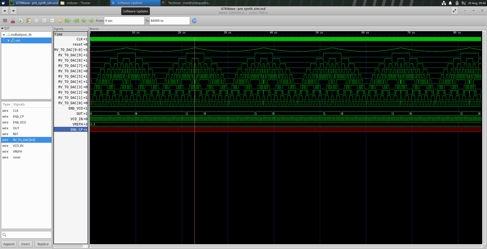
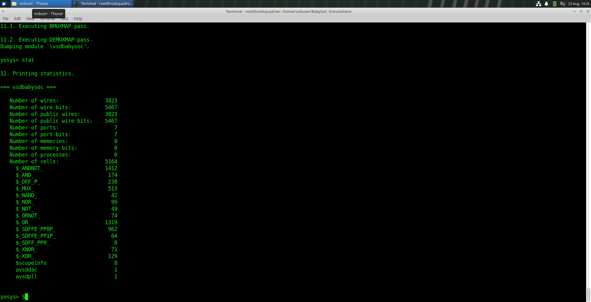
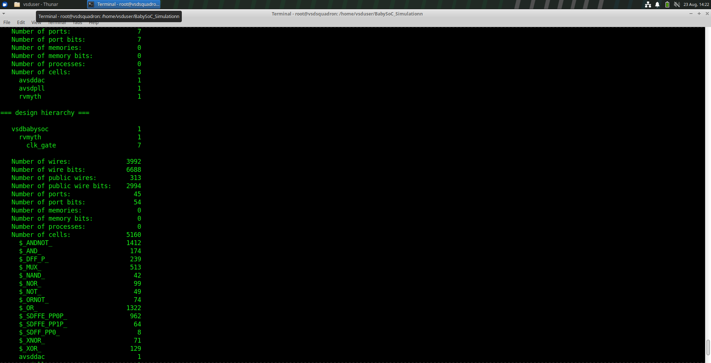
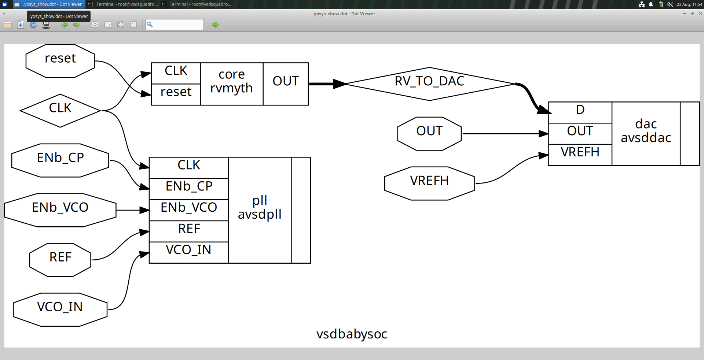
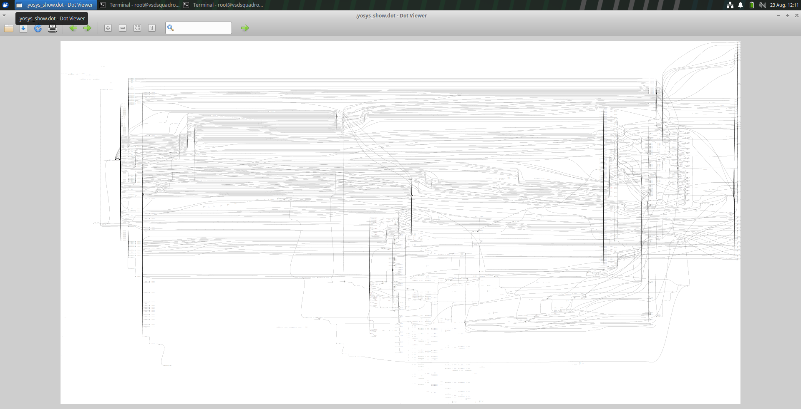
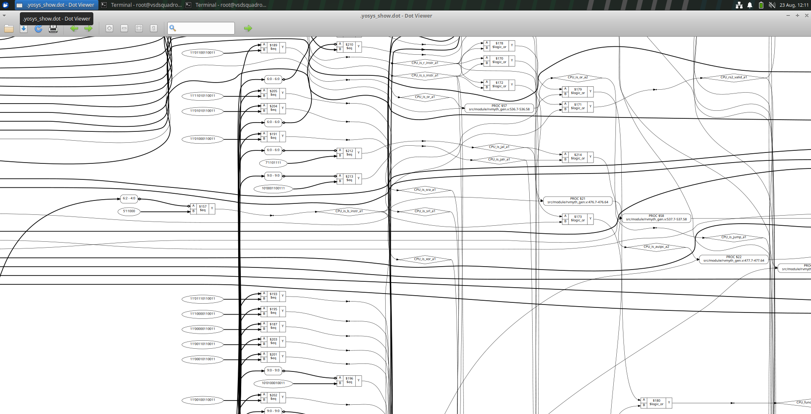
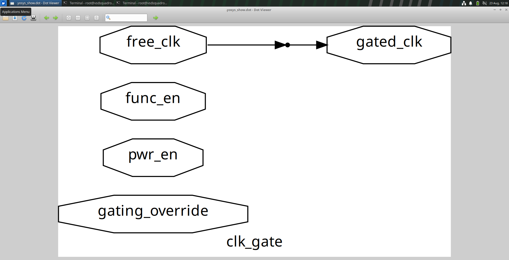
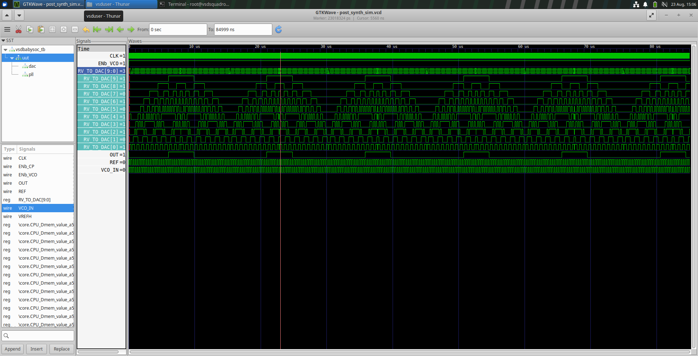

# BabySoC – From RTL to Post-Synthesis Gate-Level Verification

This folder documents my work taking a small RISC-V-based SoC ("BabySoC") through the front-end half of the ASIC design flow — from RTL description, through logic synthesis with Yosys and SKY130 technology mapping, to a post-synthesis gate-level simulation that confirms the synthesized netlist still behaves the way the original RTL did.

---

## Contents

1. [Design Overview](#1-design-overview)
2. [ASIC Flow Covered So Far](#2-asic-flow-covered-so-far)
3. [Pre-Synthesis Simulation](#3-pre-synthesis-simulation)
4. [Synthesis with Yosys](#4-synthesis-with-yosys)
5. [Technology-Mapped Netlist](#5-technology-mapped-netlist)
6. [Post-Synthesis Simulation](#6-post-synthesis-simulation)
7. [RTL vs. Gate-Level Behavior](#7-rtl-vs-gate-level-behavior)
8. [Functional GLS vs. Timing GLS](#8-functional-gls-vs-timing-gls)
9. [Tools Used](#9-tools-used)
10. [What's Next](#10-whats-next)

---

## 1. Design Overview

BabySoC is a minimal SoC built around three blocks, all instantiated inside the top module `vsdbabysoc`:

| Block | Role |
|---|---|
| **RVMyth** | RISC-V based CPU core — the digital processing element of the SoC |
| **AVSDPLL** | On-chip PLL that generates the clock the CPU runs on |
| **AVSDDAC** | DAC that converts the CPU's digital output into an analog signal |

**Signal flow at a glance:**

```
REF, VCO_IN, ENb_CP, ENb_VCO  ──►  AVSDPLL  ──► CLK ──┐
                                                        ▼
                                              reset ─► RVMyth (CPU)
                                                        │
                                                RV_TO_DAC[9:0]
                                                        ▼
                                      VREFH ─►    AVSDDAC   ─► OUT
```

The CPU drives a 10-bit bus, `RV_TO_DAC[9:0]`, straight into the DAC — that bus is the main signal tracked throughout both simulation stages below, since it's the clearest proof that the digital logic behaves identically before and after synthesis.

**Hierarchy:**

```
vsdbabysoc
├── avsddpll
├── rvmyth
└── avsddac
```

---

## 2. ASIC Flow Covered So Far

```
RTL Design → Pre-Synthesis Sim → Logic Synthesis → Tech Mapping
    → Gate-Level Netlist → Post-Synthesis Sim → (STA next)
```

| Stage | Status |
|---|---|
| RTL Design | ✅ Done |
| Pre-Synthesis Simulation | ✅ Done |
| Synthesis (Yosys) | ✅ Done |
| SKY130 Technology Mapping | ✅ Done |
| Gate-Level Netlist | ✅ Done |
| Post-Synthesis Simulation | ✅ Done |
| Static Timing Analysis | 🔜 Next |
| Floorplan → Place → CTS → Route → GDSII | ⏳ Later |

---

## 3. Pre-Synthesis Simulation

Before touching synthesis, the RTL itself was simulated to confirm it behaves as intended, using the same Icarus Verilog → GTKWave flow from earlier in the workshop.

**Signals tracked:** `CLK`, `REF`, `reset`, `VCO_IN`, `VREFH`, `RV_TO_DAC[9:0]`, `OUT`



---

## 4. Synthesis with Yosys

The RTL sources (`vsdbabysoc.v`, `rvmyth.v`, `clk_gate.v`, and the PLL/DAC blocks) were synthesized against the SKY130 high-density library:

```
Library: sky130_fd_sc_hd
Liberty: sky130_fd_sc_hd__tt_025C_1v80.lib
```

**Key Yosys commands used, and what each one does:**

| Command | Purpose |
|---|---|
| `read_verilog` | Loads the RTL source files |
| `dfflibmap` | Maps generic flip-flops to actual library flip-flop cells |
| `opt` | Removes redundant logic, propagates constants |
| `abc` | Technology-maps the design onto SKY130 cells |
| `flatten` | Collapses the module hierarchy into one netlist |
| `setundef -zero` | Resolves any undefined signals to logic 0 |
| `clean -purge` | Strips out unused/dangling logic |
| `rename -enumerate` | Gives generated internal signals systematic names |
| `write_verilog` | Writes out the final gate-level netlist |
| `show` | Renders a schematic view of the design/module |

**Post-optimization statistics:**




---

## 5. Technology-Mapped Netlist

Once `abc` finishes technology mapping, the design is no longer abstract RTL — it's built from real SKY130 standard cells, for example:

```
sky130_fd_sc_hd__nand2_1
sky130_fd_sc_hd__nor2_1
sky130_fd_sc_hd__and2_0
sky130_fd_sc_hd__mux2_1
sky130_fd_sc_hd__xor2_1
sky130_fd_sc_hd__dfrtp_1
```

The final netlist runs into thousands of these standard-cell instances across the full SoC.

**Netlist views:**






---

## 6. Post-Synthesis Simulation

The synthesized netlist was simulated using the same testbench as the RTL stage, but this time swapping in the SKY130 Verilog cell models so the simulator has actual gate-level behavior to work with — not just abstract RTL.

**Compile-time flags used:**

```
-DPOST_SYNTH_SIM -DFUNCTIONAL -DUNIT_DELAY=#1
```

```
Gate-Level Netlist + SKY130 Cell Models + Testbench
              │
              ▼
        Icarus Verilog
              │
              ▼
   post_synth_sim.vcd → GTKWave
```



---

## 7. RTL vs. Gate-Level Behavior

Comparing the pre- and post-synthesis waveforms side by side on the key signals (`CLK`, `REF`, `reset`, `RV_TO_DAC[9:0]`, `OUT`) shows the synthesized design reproducing the same digital sequence on `RV_TO_DAC` and the same resulting behavior at the DAC output `OUT` as the original RTL — confirming synthesis preserved the design's intended function for this testbench.

---

## 8. Functional GLS vs. Timing GLS

Worth being precise about which kind of gate-level simulation this actually is:

- **Functional GLS** *(what was run here)* — verifies logical correctness using the standard cells' functional models, with no real delay modeling.
- **Timing GLS** — additionally annotates real cell (and eventually interconnect) delays, so it can catch setup/hold violations. That level of check is deferred to the Static Timing Analysis stage coming up next.

---

## 9. Tools Used

- **Verilog HDL** — RTL description
- **Icarus Verilog** — RTL and gate-level simulation
- **GTKWave** — waveform viewing
- **Yosys + ABC** — synthesis and technology mapping
- **SKY130 (`sky130_fd_sc_hd`)** — standard-cell library
- **Linux** — development environment

---

## 10. What's Next

```
Static Timing Analysis
        ↓
Floorplanning → Placement → CTS → Routing → Physical Verification → GDSII
```

**Current status:** RTL → Post-Synthesis Simulation ✅ — moving on to Static Timing Analysis next.

---

## Key Takeaways

Working through BabySoC end-to-end (so far) made a few things click that were easy to gloss over in the earlier single-module labs:

- Even a small SoC has real hierarchy to reason about — signals crossing between a CPU, a PLL, and a DAC block behave differently than a single flat module.
- Synthesis isn't just "shrinking" the design — `dfflibmap` and `abc` are doing real, distinct jobs (sequential mapping vs. combinational technology mapping), and seeing thousands of actual SKY130 cell instances in the netlist makes that concrete.
- Post-synthesis simulation is the checkpoint that actually proves synthesis didn't silently change behavior — matching waveforms on `RV_TO_DAC` and `OUT` before and after synthesis is the evidence, not an assumption.
- Functional GLS is necessary but not sufficient — real timing closure only comes from STA, which is the next stage of this flow.
