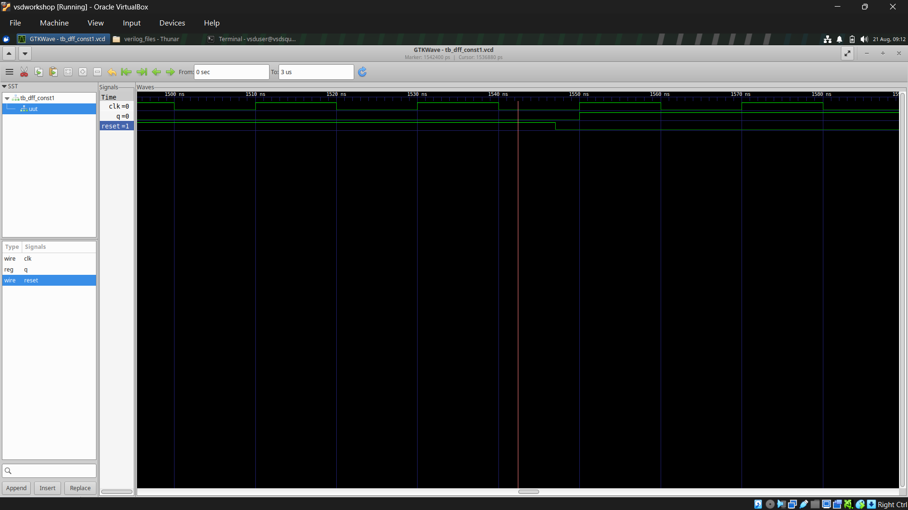
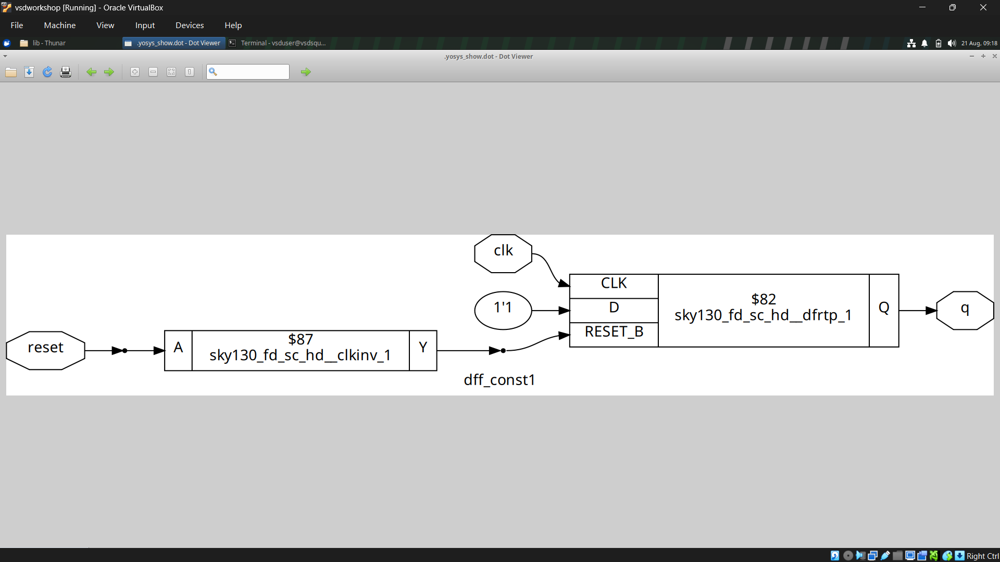
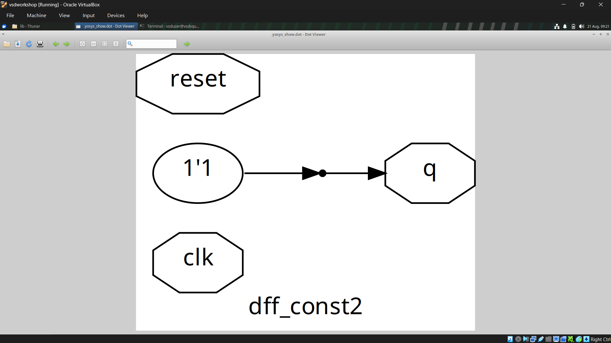
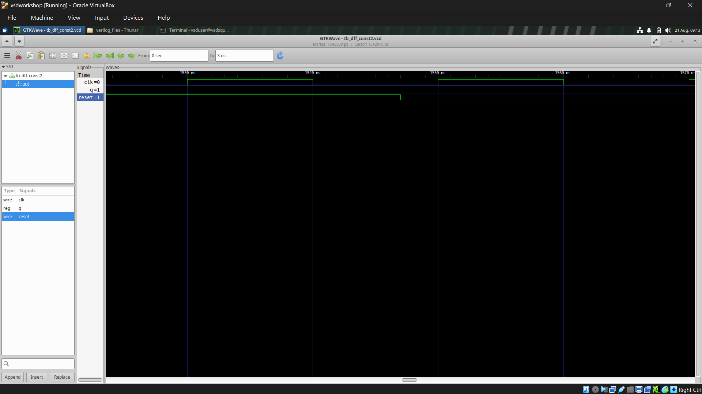
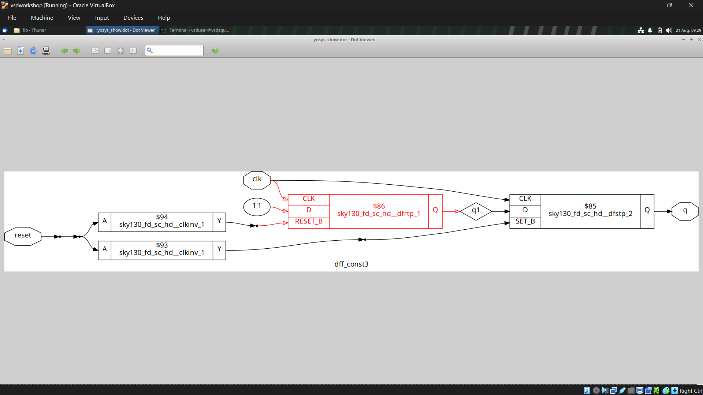
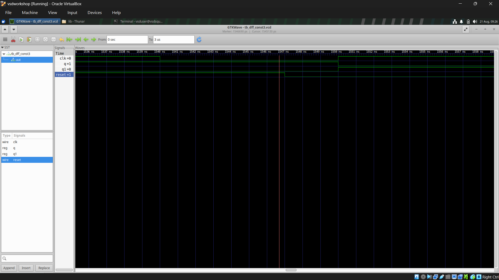

# Day 3 – Combinational & Sequential Logic Optimisation

## Objective

Day 3 focuses on **logic optimisation during synthesis**.

The main goal of optimisation is to simplify the design while maintaining the same functionality.

Optimisation helps achieve:

* **Area savings**
* **Power savings**
* **Reduced propagation delay**
* **Removal of unnecessary hardware**
* **Better overall design efficiency**

This section covers:

1. Combinational Logic Optimisation
2. Constant Propagation
3. Boolean Logic Optimisation
4. Sequential Logic Optimisation using Constant Flip-Flop examples
5. Retiming

---

# 1. Combinational Logic Optimisation

Combinational logic optimisation means **simplifying the logic of a circuit without changing its functionality**.

The synthesis tool analyses the RTL and tries to remove unnecessary or redundant logic.

### Main benefits

| Optimisation             | Benefit                      |
| ------------------------ | ---------------------------- |
| Removing redundant logic | Reduces area                 |
| Reducing switching logic | Reduces power                |
| Reducing logic levels    | Improves timing              |
| Sharing common logic     | Reduces hardware duplication |

The overall idea is:

```text
RTL Design
    ↓
Logic Analysis
    ↓
Remove / Simplify Unnecessary Logic
    ↓
Optimised Logic
    ↓
Smaller + Lower Power + Better Timing
```

---

## 1.1 Constant Propagation

**Constant propagation** is a direct optimisation technique where a signal with a known constant value (`0` or `1`) is propagated through the logic.

For example:

```text
A AND 1 = A
A AND 0 = 0

A OR 0 = A
A OR 1 = 1
```

If the synthesis tool knows that a particular input is always `0` or `1`, it can simplify or completely remove the associated logic.

### Example

Original:

```text
A ───┐
     AND ─── Y
1 ───┘
```

Since:

```text
A AND 1 = A
```

the AND gate is unnecessary.

Optimised:

```text
A ───────── Y
```

This reduces the number of gates and therefore can reduce **area and power**.

<!-- IMAGE PLACEHOLDER: Constant propagation example -->

---

## 1.2 Boolean Logic Optimisation

**Boolean logic optimisation** uses Boolean algebra to simplify logic expressions and remove redundant gates.

Some common simplifications are:

| Expression | Simplified form |
| ---------- | --------------- |
| `A + 0`    | `A`             |
| `A + 1`    | `1`             |
| `A · 0`    | `0`             |
| `A · 1`    | `A`             |
| `A + A`    | `A`             |
| `A · A`    | `A`             |
| `A + A'`   | `1`             |
| `A · A'`   | `0`             |

### Example

Consider:

```text
Y = A + A·B
```

Using the absorption law:

```text
A + A·B = A
```

Therefore:

```text
Y = A
```

The AND and OR gates required by the original expression can be removed.

<!-- IMAGE PLACEHOLDER: Boolean logic optimisation example -->

### Key idea

```text
Complex Logic
     ↓
Boolean Simplification
     ↓
Fewer Gates
     ↓
Lower Area + Lower Power + Lower Delay
```

---

# 2. Sequential Logic Optimisation

Sequential logic contains **flip-flops/registers**, so optimisation is not limited to removing combinational gates.

The synthesis tool can also analyse the behaviour of flip-flops and determine whether some of them are unnecessary.

A simple way to demonstrate this is by using **constant flip-flop examples**.

In this experiment, three different flip-flop RTL descriptions are:

1. Synthesized using **Yosys**
2. Examined using the generated schematic
3. Simulated using **Icarus Verilog**
4. Observed using **GTKWave**

<!-- IMAGE PLACEHOLDER: Screenshot showing all three Verilog files -->

---

# 3. Constant Flip-Flop Optimisation

## 3.1 Example 1 – `dff_const1.v`

The first design is a flip-flop with an asynchronous reset.

### Verilog Code

```verilog
module dff_const1(input clk, input reset, output reg q);

always @(posedge clk, posedge reset)
begin
    if(reset)
        q <= 1'b0;
    else
        q <= 1'b1;
end

endmodule
```

### Working

The behaviour is:

| Condition                 | `q` |
| ------------------------- | --- |
| `reset = 1`               | `0` |
| `reset = 0` at clock edge | `1` |

Therefore, the output is not constant all the time.

The synthesis tool must retain the required flip-flop functionality.

### Synthesized Result

The synthesized circuit contains a **D flip-flop** with:

* `D = 1`
* Asynchronous reset
* Output `Q = q`

The reset signal is converted to the appropriate reset input of the standard-cell flip-flop.

<!-- IMAGE PLACEHOLDER: dff_const1 synthesized schematic -->

### Simulation

The design was simulated using Icarus Verilog and the output was observed in GTKWave.

The waveform demonstrates that:

* `q` is `0` when reset is active.
* After reset is released, `q` becomes `1` on the appropriate clock edge.
* The output then remains `1`.




---

# 4. Example 2 – `dff_const2.v`

The second example demonstrates a much stronger optimisation opportunity.

### Verilog Code

```verilog
module dff_const2(input clk, input reset, output reg q);

always @(posedge clk, posedge reset)
begin
    if(reset)
        q <= 1'b1;
    else
        q <= 1'b1;
end

endmodule
```

### Working

Notice that both branches assign exactly the same value:

```text
if (reset)
    q = 1
else
    q = 1
```

Therefore:

```text
q = 1
```

under all conditions.

The value of `q` does not actually depend on:

* `reset`
* `clk`

The flip-flop is therefore unnecessary.

### Synthesized Result

Yosys identifies that the output is always a constant `1`.

Instead of keeping a flip-flop, the synthesis tool reduces the design to:

```text
1'b1 ─────────► q
```

The flip-flop is completely removed.




This is a clear example of **constant propagation and sequential logic optimisation**.

### Simulation

The GTKWave waveform confirms that `q` remains at:

```text
q = 1
```

throughout the simulation.




### Key Observation

Although the RTL code describes a flip-flop, the synthesized hardware does **not** require a flip-flop.

This demonstrates an important point:

> **Synthesis optimises hardware based on actual logic behaviour, not simply on the structure written in RTL.**

---

# 5. Example 3 – `dff_const3.v`

The third example contains **two flip-flops** and demonstrates how sequential dependency affects optimisation.

### Verilog Code

```verilog
module dff_const3(input clk, input reset, output reg q, output reg q1);

always @(posedge clk, posedge reset)
begin
    if(reset)
    begin
        q  <= 1'b1;
        q1 <= 1'b0;
    end
    else
    begin
        q1 <= 1'b1;
        q  <= q1;
    end
end

endmodule
```

### Working

During reset:

```text
q  = 1
q1 = 0
```

After reset is released:

```text
q1 = 1
q  = previous value of q1
```

Because `q` depends on the previous value of `q1`, there is a **sequential dependency** between the two flip-flops.

### Synthesized Result

The synthesized schematic contains two flip-flops:

```text
       ┌──────┐
clk ──►│  FF  │──► q1
       └──────┘
           │
           ▼
       ┌──────┐
clk ──►│  FF  │──► q
       └──────┘
```

The synthesis tool retains the sequential elements because their behaviour cannot simply be replaced by a constant connection.




### Simulation

The GTKWave waveform shows the expected behaviour:

During reset:

```text
q  = 1
q1 = 0
```

After reset is released:

```text
q1 → 1
q  → follows the previous value of q1
```



---

# 6. Comparison of the Three Designs

| Design         | RTL Behaviour                              | Optimisation Result                |
| -------------- | ------------------------------------------ | ---------------------------------- |
| `dff_const1.v` | `q = 0` during reset and `q = 1` otherwise | Flip-flop retained                 |
| `dff_const2.v` | `q = 1` in both reset and normal operation | Flip-flop removed; `q` tied to `1` |
| `dff_const3.v` | `q` and `q1` have a sequential dependency  | Two flip-flops retained            |

### What does this demonstrate?

These three examples show that the synthesis tool performs **logic analysis and optimisation** before producing the final netlist.

```text
RTL
 ↓
Synthesis
 ↓
Analyse Behaviour
 ↓
Identify Constants / Redundant Logic
 ↓
Optimise
 ↓
Generate Netlist
```

The important example is `dff_const2.v`.

Even though a flip-flop is explicitly written in the RTL, the synthesis tool recognises that its output is always `1` and removes the flip-flop completely.

---

# 7. Retiming

**Retiming** is a sequential optimisation technique in which flip-flops/registers are moved across combinational logic while maintaining the same overall functionality.

The main purpose is to **balance combinational path delays and improve timing**.

### Example

Before retiming:

```text
FF ──► Long Combinational Logic ──► FF ──► Short Logic ──► FF
             200 MHz                         500 MHz
```

The slower path limits the maximum operating frequency.

After retiming, the registers can be repositioned to distribute the logic more evenly:

```text
FF ──► Logic ──► FF ──► Logic ──► FF
       Balanced combinational paths
```

For example, if one path effectively supports **200 MHz** and another supports **500 MHz**, retiming can redistribute the logic so that the paths are more balanced and the overall timing can improve.

> **Key idea:** Retiming changes the **location of registers**, not the required functionality of the design.

<!-- IMAGE PLACEHOLDER: Retiming example -->

---

# 8. Key Takeaways

### Combinational Optimisation

* Simplifies logic without changing functionality.
* **Constant propagation** removes logic based on known `0` or `1` values.
* **Boolean optimisation** uses Boolean algebra to remove redundant logic.
* Fewer gates can reduce **area, power and delay**.

### Sequential Optimisation

* Synthesis tools can identify unnecessary flip-flops.
* A flip-flop whose output is always constant can be completely removed.
* `dff_const1` retains a flip-flop because its output depends on reset.
* `dff_const2` removes the flip-flop because `q` is always `1`.
* `dff_const3` retains the sequential logic because `q` depends on `q1`.

### Retiming

* Moves registers across combinational logic.
* Balances logic between sequential stages.
* Mainly used to improve **timing and maximum operating frequency**.

> **Overall:** Optimisation allows the synthesis tool to produce a more efficient hardware implementation while preserving the intended functionality.
