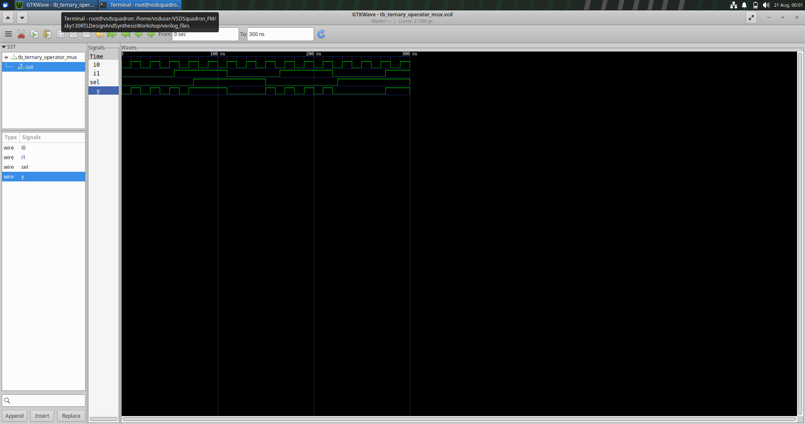
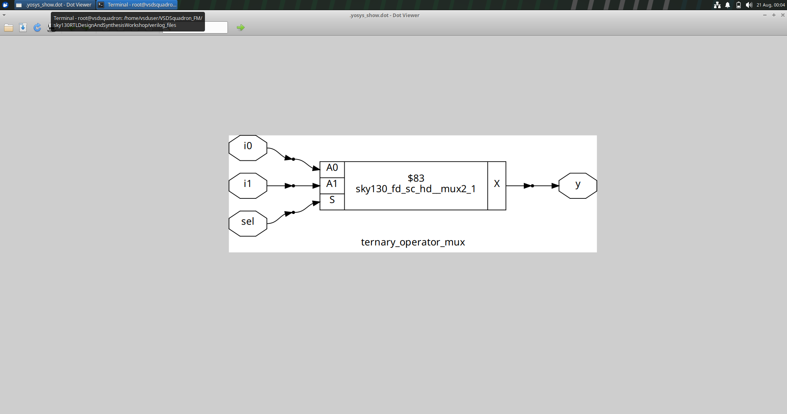
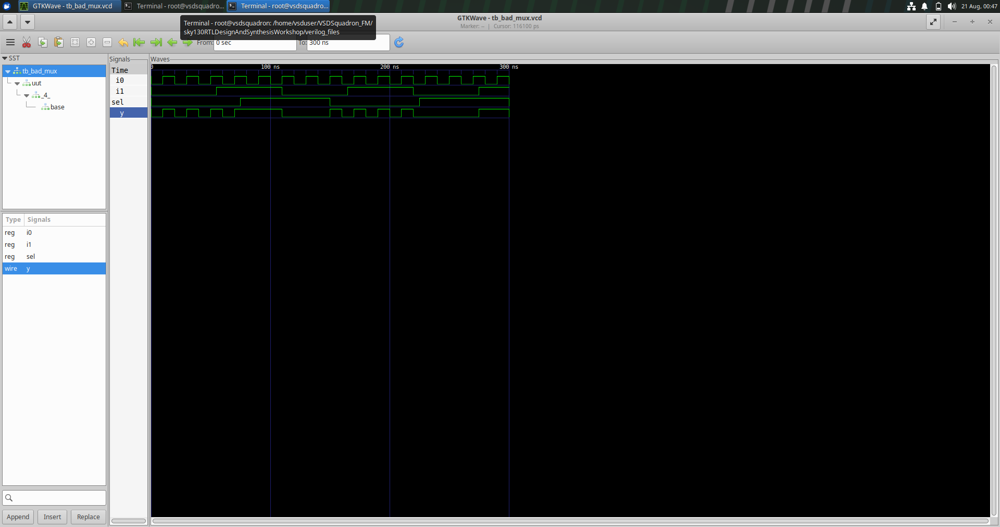
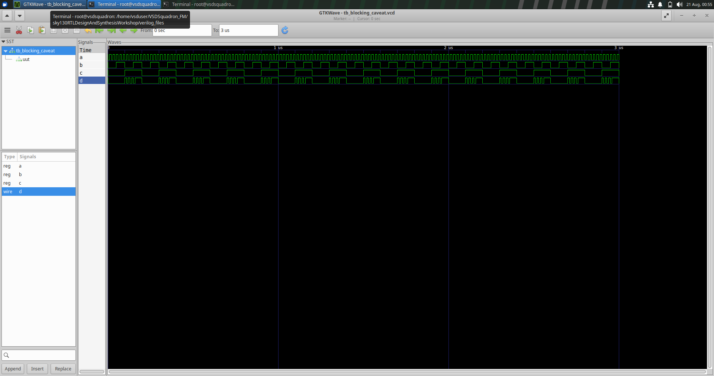
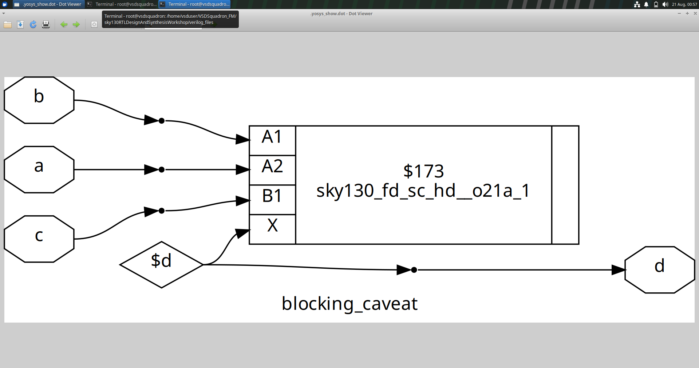

# Day 4 - RTL Design, Synthesis and Gate-Level Simulation

## Overview

Day 4 of the VSD RTL Design Workshop focused on understanding the transition from RTL design to synthesized hardware and Gate-Level Simulation. The experiments provided practical exposure to Verilog coding, RTL simulation, synthesis using Yosys, standard-cell mapping, netlist generation and waveform analysis.

The major concepts covered during this session were:

- Ternary operator based MUX
- RTL simulation
- Logic synthesis using Yosys
- Standard-cell mapping
- Gate-level netlist generation
- Gate-Level Simulation
- Incomplete sensitivity lists
- Blocking assignments
- RTL versus Gate-Level waveforms
- Simulation-synthesis mismatch

## Table of Contents

1. [RTL to Gate-Level Simulation Flow](#1-rtl-to-gate-level-simulation-flow)
2. [Ternary Operator MUX](#2-ternary-operator-mux)
   - [Working Principle](#21-working-principle)
   - [RTL Simulation](#22-rtl-simulation)
   - [Synthesis](#23-synthesis)
   - [Gate-Level Simulation](#24-gate-level-simulation)
3. [Bad MUX - Incomplete Sensitivity List](#3-bad-mux---incomplete-sensitivity-list)
   - [Problem](#31-problem)
   - [RTL Simulation](#32-rtl-simulation)
   - [Synthesis and Gate-Level Simulation](#33-synthesis-and-gate-level-simulation)
   - [Correct Coding Style](#34-correct-coding-style)
4. [Blocking Assignment Caveat](#4-blocking-assignment-caveat)
   - [Blocking Assignment](#41-blocking-assignment)
   - [RTL Simulation](#42-rtl-simulation)
   - [Synthesis](#43-synthesis)
   - [Gate-Level Simulation](#44-gate-level-simulation)
5. [Blocking vs Non-Blocking Assignments](#5-blocking-vs-non-blocking-assignments)
6. [Importance of always @(*)](#6-importance-of-always-)
7. [Simulation-Synthesis Mismatch](#7-simulation-synthesis-mismatch)
8. [RTL Simulation vs Gate-Level Simulation](#8-rtl-simulation-vs-gate-level-simulation)
9. [Tools Used](#9-tools-used)
10. [Key Observations](#10-key-observations)
11. [Learning Outcomes](#11-learning-outcomes)
12. [Conclusion](#12-conclusion)

---

# 1. RTL to Gate-Level Simulation Flow

The Day 4 experiments followed the RTL-to-Gate-Level verification flow:

    RTL Verilog Code
           |
           v
    RTL Simulation
           |
           v
    Yosys Synthesis
           |
           v
    Technology Mapping
           |
           v
    Gate-Level Netlist
           |
           v
    Gate-Level Simulation
           |
           v
    GTKWave
           |
           v
    Waveform Analysis

RTL simulation is used to verify the functionality described by the Verilog code. After synthesis, the RTL is converted into a gate-level implementation using standard cells. The generated netlist can then be simulated to verify the behaviour of the synthesized design.

---

# 2. Ternary Operator MUX

## 2.1 Working Principle

A multiplexer is a combinational circuit that selects one input from multiple inputs and transfers the selected input to the output.

For a 2:1 multiplexer:

    i0 --------\
                \
                 >---- y
                /
    i1 --------/
             |
            sel

The operation is:

    sel = 0  ->  y = i0
    sel = 1  ->  y = i1

The same functionality can be described in Verilog using the ternary operator:

    assign y = sel ? i1 : i0;

The ternary operator provides a compact way to describe conditional selection logic.

## 2.2 RTL Simulation

The MUX was first verified using RTL simulation.

The main signals observed in the waveform were:

    i0
    i1
    sel
    y

When `sel` is LOW, the output follows `i0`.

When `sel` is HIGH, the output follows `i1`.

### RTL Waveform

The waveform confirms the expected functional behaviour of the MUX at the RTL level.

## 2.3 Synthesis

After RTL simulation, the design was synthesized using Yosys.

During synthesis, the RTL description was converted into a hardware implementation using cells from the SKY130 standard-cell library.

The MUX was mapped to the following standard cell:

    sky130_fd_sc_hd__mux2_1

### Synthesized Netlist

The synthesized netlist shows how the RTL description is transformed into a standard-cell based hardware implementation.

The RTL statement:

    assign y = sel ? i1 : i0;

is converted into an appropriate library-cell implementation during synthesis.

## 2.4 Gate-Level Simulation

The synthesized netlist was then used for Gate-Level Simulation.

The testbench was used to apply the required input combinations and the resulting waveform was observed using GTKWave.

### Gate-Level Waveform

The RTL and Gate-Level waveforms can be compared to verify that the synthesized implementation preserves the intended MUX functionality.

The complete flow can be represented as:

    RTL MUX
       |
       v
    Ternary Operator
       |
       v
    Yosys Synthesis
       |
       v
    sky130_fd_sc_hd__mux2_1
       |
       v
    Gate-Level Simulation

---

# 3. Bad MUX - Incomplete Sensitivity List

## 3.1 Problem

A MUX can also be described using an `always` block.

An incorrect implementation can be written as:

    always @(sel)
    begin
        if (sel)
            y = i1;
        else
            y = i0;
    end

The problem is that only `sel` is included in the sensitivity list.

However, the output depends on all three signals: `sel`, `i0` and `i1`.

Therefore, if `sel` changes, the block executes and the output is updated.

However, if `i0` or `i1` changes while `sel` remains unchanged, the block may not execute.

This can result in incorrect RTL simulation behaviour.

## 3.2 RTL Simulation

The Bad MUX was simulated to observe the effect of the incomplete sensitivity list.

### RTL Waveform

The waveform demonstrates that changes in `i0` or `i1` may not immediately update the output when `sel` remains unchanged.

This happens because the RTL simulator executes the `always` block only when a signal included in its sensitivity list changes.

## 3.3 Synthesis and Gate-Level Simulation

The sensitivity list is primarily a simulation construct. It does not represent an actual hardware component.

During synthesis, the synthesizer analyses the logic described inside the procedural block and generates the corresponding hardware.

Therefore, an incomplete sensitivity list can cause a difference between RTL simulation and the behaviour of the synthesized hardware.

### Gate-Level Waveform

The Gate-Level Simulation can be compared with the RTL waveform to observe the difference between simulation behaviour and synthesized hardware behaviour.

This experiment demonstrates how careless RTL coding can result in a simulation-synthesis mismatch.

## 3.4 Correct Coding Style

For combinational logic, a safer implementation is:

    always @(*)
    begin
        if (sel)
            y = i1;
        else
            y = i0;
    end

The `@(*)` construct automatically includes the signals referenced inside the procedural block in the sensitivity list.

Therefore, instead of:

    always @(sel)

the preferred form for this combinational logic is:

    always @(*)

This reduces the possibility of accidentally omitting input signals from the sensitivity list.

---

# 4. Blocking Assignment Caveat

## 4.1 Blocking Assignment

Verilog provides two commonly used procedural assignment operators:

    Blocking assignment       =
    Non-blocking assignment   <=

A blocking assignment executes immediately within the procedural flow.

For example:

    always @(*)
    begin
        x = a | b;
        d = x & c;
    end

The first statement executes before the second statement.

Therefore, the updated value of `x` is available to the following statement during RTL simulation.

The ordering of statements is consequently important when blocking assignments are used.

## 4.2 RTL Simulation

The blocking assignment experiment was simulated at the RTL level.

The logic can be represented conceptually as:

    a ----\
           OR ---- x ----\
    b ----/              AND ----> d
                         /
    c ------------------/

### RTL Waveform

The waveform demonstrates the behaviour of the intermediate signal and the output during RTL simulation.

Since blocking assignments execute sequentially, the updated value of an intermediate signal can be used immediately by the next statement.

## 4.3 Synthesis

The design was synthesized using Yosys.

The RTL was mapped to cells from the SKY130 standard-cell library.

The relevant synthesized logic includes:

    sky130_fd_sc_hd__o21a_1

### Synthesized Netlist

The synthesized netlist represents the combinational hardware generated from the RTL description.

The procedural statements in RTL are converted into logic connections between standard cells.

## 4.4 Gate-Level Simulation

The synthesized netlist was then simulated at the gate level.

### Gate-Level Waveform

The Gate-Level Simulation waveform represents the behaviour of the synthesized circuit.

Comparing the RTL and GLS waveforms helps in understanding the difference between procedural RTL execution and the synthesized hardware implementation.

The basic concept can be represented as:

    Blocking Assignment
            |
            v
    Sequential RTL Execution
            |
            v
    Intermediate Signal Update
            |
            v
    Following Statement Uses Updated Value

This demonstrates why the ordering of blocking assignments should be considered carefully when writing combinational RTL.

---

# 5. Blocking vs Non-Blocking Assignments

## Blocking Assignment

The blocking assignment operator is:

    =

Example:

    always @(*)
    begin
        x = a | b;
        d = x & c;
    end

The statements execute sequentially, and the updated value of `x` is immediately available to the next statement.

Blocking assignments are generally used for combinational procedural logic.

## Non-Blocking Assignment

The non-blocking assignment operator is:

    <=

Example:

    always @(posedge clk)
    begin
        q <= d;
    end

Non-blocking assignments schedule updates to occur after the current evaluation.

They are generally used for sequential logic such as flip-flops and registers.

| Blocking `=` | Non-Blocking `<=` |
|---|---|
| Executes immediately | Update is scheduled |
| Statements execute sequentially | Updates occur after evaluation |
| Commonly used for combinational logic | Commonly used for sequential logic |
| Statement order can affect intermediate values | Useful for modelling simultaneous register updates |

---

# 6. Importance of `always @(*)`

When combinational logic is described using an `always` block, all signals that can affect the output should be considered.

An incomplete sensitivity list such as:

    always @(sel)

can result in incorrect RTL simulation behaviour.

A safer form is:

    always @(*)

For example:

    always @(*)
    begin
        if (sel)
            y = i1;
        else
            y = i0;
    end

This allows changes in `sel`, `i0` and `i1` to trigger the procedural block.

The use of `always @(*)` therefore reduces the chance of simulation-synthesis mismatches caused by accidentally missing input signals.

---

# 7. Simulation-Synthesis Mismatch

A simulation-synthesis mismatch occurs when the behaviour observed during RTL simulation differs from the behaviour of the synthesized hardware.

The Day 4 experiments demonstrated this concept through the Bad MUX example and the blocking assignment experiment.

### Incomplete Sensitivity List

    always @(sel)

The RTL simulator responds only to changes in `sel`, even though `i0` and `i1` also affect the output.

The synthesized hardware, however, is based on the actual logic relationship between the inputs and output.

### Blocking Assignment

    always @(*)
    begin
        x = a | b;
        d = x & c;
    end

Blocking assignments execute sequentially during RTL simulation.

Therefore, statement ordering can affect the values observed during simulation.

The overall concept can be represented as:

    RTL Coding Issue
           |
           v
    Unexpected RTL Simulation
           |
           v
        Synthesis
           |
           v
    Hardware Implementation
           |
           v
    RTL vs GLS Comparison

This demonstrates the importance of writing synthesizable and simulation-correct RTL.

---

# 8. RTL Simulation vs Gate-Level Simulation

| Feature | RTL Simulation | Gate-Level Simulation |
|---|---|---|
| Input | RTL Verilog | Synthesized netlist |
| Stage | Before synthesis | After synthesis |
| Main purpose | Functional verification | Post-synthesis verification |
| Representation | RTL description | Standard-cell implementation |
| Timing | Mainly functional | Can include cell and gate delays |
| Simulator | Icarus Verilog | Icarus Verilog |
| Waveform viewer | GTKWave | GTKWave |

RTL simulation checks the intended functionality of the design.

Gate-Level Simulation checks the behaviour of the synthesized implementation and provides another level of verification after synthesis.

Comparing both waveforms helps confirm that the synthesized circuit represents the intended RTL behaviour.

---

# 9. Tools Used

| Tool | Purpose |
|---|---|
| Yosys | RTL synthesis and netlist generation |
| Icarus Verilog | Verilog compilation and simulation |
| GTKWave | Waveform viewing and analysis |
| SKY130 PDK | Standard-cell library used during technology mapping |

---

# 10. Key Observations

### Ternary Operator MUX

    RTL Description
          |
          v
    assign y = sel ? i1 : i0;
          |
          v
    Yosys Synthesis
          |
          v
    sky130_fd_sc_hd__mux2_1
          |
          v
    Gate-Level Simulation

The ternary operator provides a simple and compact way to describe a 2:1 MUX.

### Bad MUX

    always @(sel)

does not include all the input signals that affect the output.

The safer combinational form is:

    always @(*)

### Blocking Assignment

    x = a | b;
    d = x & c;

Blocking assignments execute sequentially during RTL simulation.

Therefore, statement ordering can affect intermediate values.

### Gate-Level Simulation

    RTL
     |
     v
    Synthesis
     |
     v
    Gate-Level Netlist
     |
     v
    Gate-Level Simulation
     |
     v
    Waveform Analysis

Gate-Level Simulation provides an additional verification step after synthesis.

---

# 11. Learning Outcomes

After completing Day 4, I gained an understanding of:

- RTL-to-Gate-Level Simulation flow
- Ternary operator based MUX design
- RTL simulation
- Synthesis using Yosys
- Standard-cell mapping
- Gate-level netlist generation
- Gate-Level Simulation
- Waveform analysis using GTKWave
- Sensitivity lists in Verilog
- The importance of `always @(*)`
- Blocking assignments
- Non-blocking assignments
- Simulation-synthesis mismatch
- Proper coding practices for combinational RTL
- Comparison between RTL and synthesized hardware behaviour

The experiments also helped connect theoretical concepts with the actual behaviour observed in simulation waveforms and synthesized netlists.

---

# 12. Conclusion

Day 4 provided practical exposure to the complete flow from RTL design to synthesized hardware and Gate-Level Simulation.

The ternary operator MUX experiment demonstrated how a simple RTL description can be converted into a standard-cell implementation. The Bad MUX experiment showed the effect of an incomplete sensitivity list and how it can lead to differences between RTL simulation and synthesized hardware behaviour. The blocking assignment experiment further demonstrated how procedural statement ordering can influence RTL simulation.

By analysing RTL waveforms, synthesized netlists and Gate-Level Simulation waveforms, I developed a clearer understanding of how Verilog RTL is transformed into hardware.

The experiments also provided practical experience with Yosys, Icarus Verilog and GTKWave. Overall, Day 4 helped strengthen my understanding of RTL coding practices, synthesis and post-synthesis verification and showed why careful RTL design is important for developing reliable digital hardware.

