# Day 5 – IF-ELSE, CASE, and Looping Constructs

Day 5 focuses on RTL coding styles used to describe conditional logic and repetitive hardware structures in Verilog. The experiments cover priority-based `if-else` statements, selection using `case` statements, inferred latches caused by incomplete assignments, overlapping `casez` conditions, synthesis optimization, procedural `for` loops, and generate loops.

The practical work also includes MUX and DEMUX implementations and a Ripple Carry Adder built using a generate loop. Simulation waveforms and synthesized netlists are used to observe and verify the behavior of the designs.

---

## Table of Contents

- [RTL Coding Styles: IF-ELSE and CASE Statements](#rtl-coding-styles-if-else-and-case-statements)
- [Inferred Latches](#inferred-latches)
- [Labs 1–2: Incomplete IF Statements](#labs-12-incomplete-if-statements)
- [Labs 3–5: CASE Statements](#labs-35-case-statements)
- [Lab 6: Overlapping CASE Statements](#lab-6-overlapping-case-statements)
- [Redundancy Optimization During Synthesis](#redundancy-optimization-during-synthesis)
- [Looping Constructs in Verilog](#looping-constructs-in-verilog)
- [Labs 7–10: Loop-Based MUX, DEMUX, and RCA](#labs-710-loop-based-mux-demux-and-rca)
- [Overall Summary](#overall-summary)

---

## RTL Coding Styles: IF-ELSE and CASE Statements

RTL coding describes the operation of a digital circuit before it is converted into gates by synthesis. The way the RTL is written determines how the synthesis tool interprets the intended hardware.

Conditional statements are frequently used in RTL to select data, control operations, and describe decision-making logic.

### Priority Logic Using IF-ELSE

An `if-else` structure evaluates conditions in a defined order. If multiple conditions are true, the first true condition takes precedence.

    always @(*) begin
        if (condition_1)
            y = value_1;
        else if (condition_2)
            y = value_2;
        else
            y = value_3;
    end

The priority can be understood as:

| Statement | Priority |
|---|---|
| `if` | Highest |
| `else if` | Next |
| `else` | Lowest |

Therefore, `if-else` is appropriate when the order in which conditions are checked is important, such as in priority encoders and control logic.

### Selection Logic Using CASE

A `case` statement compares a selector expression with a set of possible values.

    always @(*) begin
        case (sel)
            2'b00: y = a;
            2'b01: y = b;
            2'b10: y = c;
            default: y = d;
        endcase
    end

This coding style is useful when different input values should directly select different operations or data paths.

Common applications include:

- Multiplexers
- Decoders
- State machines
- Control logic

### IF-ELSE and CASE Comparison

| Feature | IF-ELSE | CASE |
|---|---|---|
| Main purpose | Priority-based decisions | Multi-way selection |
| Evaluation | Conditions are checked sequentially | Selector is compared with case items |
| Typical applications | Priority logic and control | MUX, decoder, FSM |
| Main coding concern | Condition ordering and completeness | Coverage and overlapping patterns |

---

## Inferred Latches

A latch is a level-sensitive storage element that retains its previous value when a new value is not provided.

In combinational RTL, an unintended latch can be inferred when an output is not assigned for every possible input condition.

For example:

    always @(*) begin
        if (enable)
            y = data;
    end

When `enable` is high, `y` receives `data`.

When `enable` is low, there is no assignment to `y`. The circuit therefore needs to retain the previous value, which results in latch inference during synthesis.

A complete combinational description can be written as:

    always @(*) begin
        if (enable)
            y = data;
        else
            y = 1'b0;
    end

Another approach is to provide a default assignment:

    always @(*) begin
        y = 1'b0;

        if (enable)
            y = data;
    end

### Latch Inference vs Sequential Storage

Latch inference in a combinational block should not be confused with the intentional storage behavior of a flip-flop.

For example:

    always @(posedge clk or posedge reset) begin
        if (reset)
            count <= 0;
        else if (enable)
            count <= count + 1;
    end

Here, `count` is stored in flip-flops because the block is triggered by a clock edge.

If `enable` is low, the flip-flop simply retains its previous state. This is intended sequential behavior and is not an unintended latch.

---

## Labs 1–2: Incomplete IF Statements

### Lab 1 – Incomplete IF Statement (`incomp_if.v`)

The first experiment demonstrates how an incomplete combinational `if` statement can result in latch inference.

    always @(*) begin
        if (i0)
            y = i1;
    end

Only one condition is specified.

| `i0` | Output behavior |
|---|---|
| `1` | `y = i1` |
| `0` | `y` is not assigned |

When `i0 = 0`, no new value is assigned to `y`. The synthesized circuit therefore needs to retain the previous value.

### Waveform

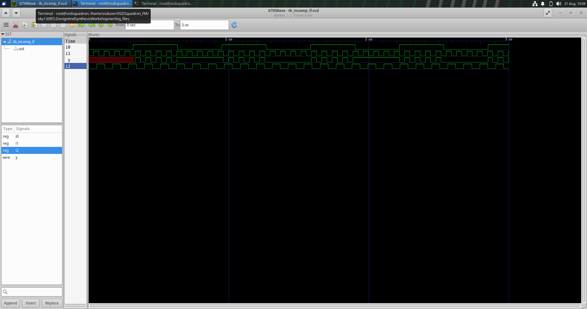

### Synthesized Netlist

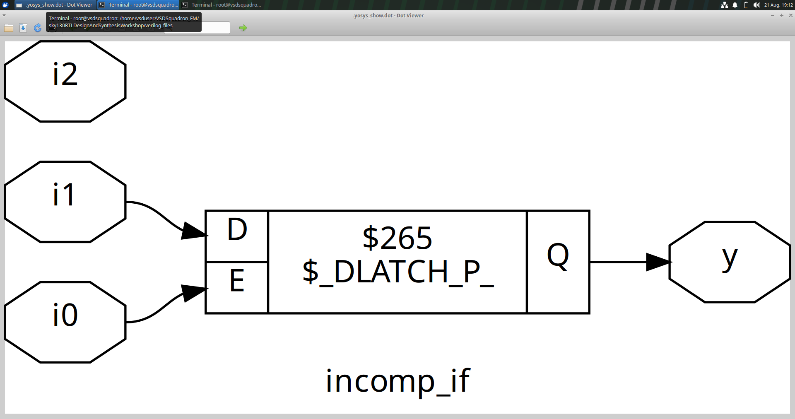

### Learning Outcome

A combinational output must be assigned for all required input conditions. Missing assignments can cause unintended latch inference.

---

### Lab 2 – Incomplete IF-ELSE Statement (`incomp_if2.v`)

The second experiment introduces an additional `else if` condition.

    always @(*) begin
        if (i0)
            y = i1;
        else if (i2)
            y = i3;
    end

The output behavior is:

| `i0` | `i2` | Output |
|---|---|---|
| `1` | X | `y = i1` |
| `0` | `1` | `y = i3` |
| `0` | `0` | No assignment |

The final combination is not covered. Therefore, the output can retain its previous value and a latch may be inferred.

### Synthesized Netlist

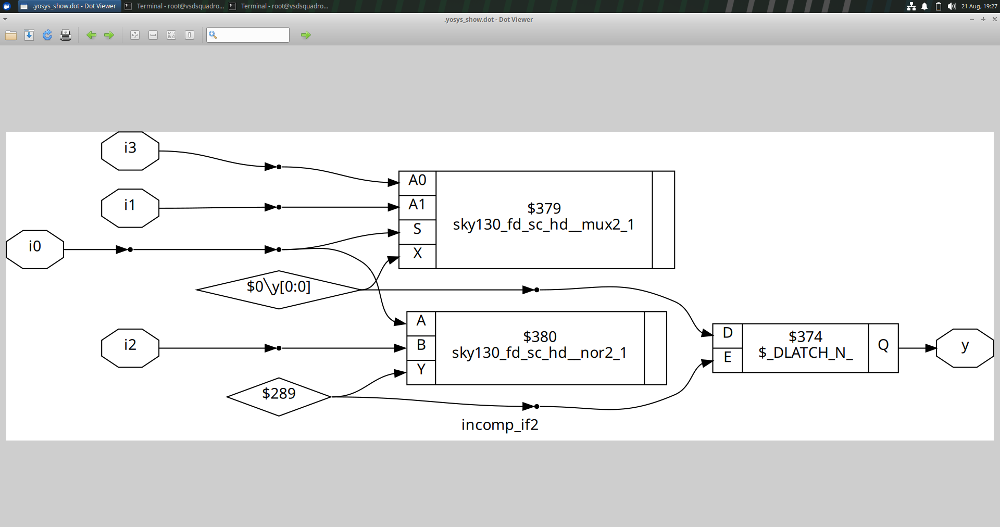

### Complete Version

    always @(*) begin
        if (i0)
            y = i1;
        else if (i2)
            y = i3;
        else
            y = 1'b0;
    end

The final `else` provides a defined output for the remaining condition.

### Learning Outcome

An `else if` chain can still be incomplete. For combinational logic, every possible execution path must produce a defined output.

---

## Labs 3–5: CASE Statements

### Lab 3 – Incomplete CASE Statement (`incomp_case.v`)

This experiment demonstrates incomplete selector coverage in a `case` statement.

    always @(*) begin
        case (sel)
            2'b00: y = i0;
            2'b01: y = i1;
        endcase
    end

A 2-bit selector has four possible combinations, but only two are explicitly described.

| `sel` | Output |
|---|---|
| `2'b00` | `y = i0` |
| `2'b01` | `y = i1` |
| `2'b10` | No assignment |
| `2'b11` | No assignment |

The uncovered selector values can cause the synthesis tool to infer storage.

### Waveform

### Synthesized Netlist

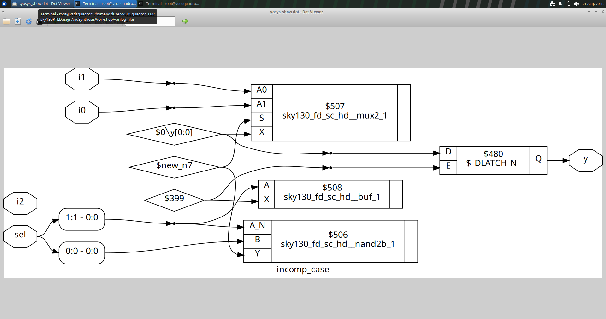

### Learning Outcome

When a `case` statement is used to describe combinational logic, selector conditions should be covered completely or an appropriate default behavior should be specified.

---

### Lab 4 – Complete CASE Statement (`comp_case.v`)

The incomplete case statement can be completed by adding a `default` branch.

    always @(*) begin
        case (sel)
            2'b00: y = i0;
            2'b01: y = i1;
            default: y = i2;
        endcase
    end

The resulting behavior is:

| `sel` | Output |
|---|---|
| `2'b00` | `y = i0` |
| `2'b01` | `y = i1` |
| `2'b10` | `y = i2` |
| `2'b11` | `y = i2` |

### Waveform

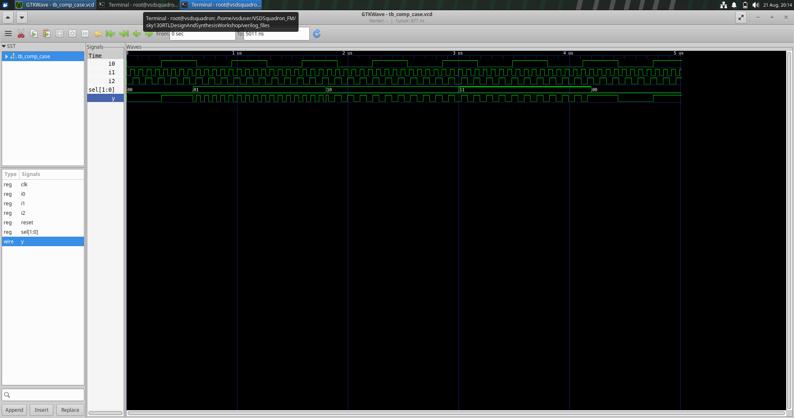

### Synthesized Netlist

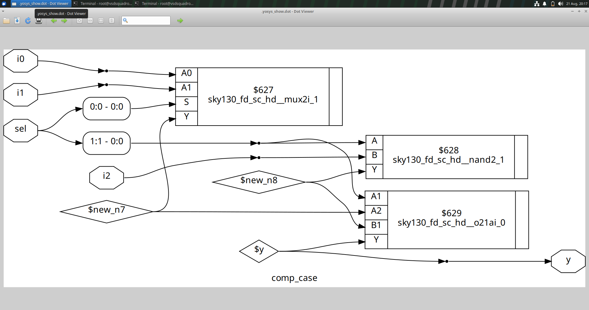

### Learning Outcome

The `default` branch provides a defined output for selector values that are not explicitly listed.

---

### Lab 5 – Partial Output Assignment (`partial_case_assign.v`)

This experiment shows that incomplete assignment can affect one output even when another output is assigned correctly.

    always @(*) begin
        case (sel)

            2'b00: begin
                y = i0;
                x = i2;
            end

            2'b01: begin
                y = i1;
            end

            default: begin
                y = i3;
                x = i4;
            end

        endcase
    end

The output `y` is assigned in every branch, but `x` is not assigned when `sel = 2'b01`.

| `sel` | `y` | `x` |
|---|---|---|
| `2'b00` | `i0` | `i2` |
| `2'b01` | `i1` | Previous value |
| Default | `i3` | `i4` |

Thus, the incomplete assignment can result in storage being inferred for `x`.

### Synthesized Netlist

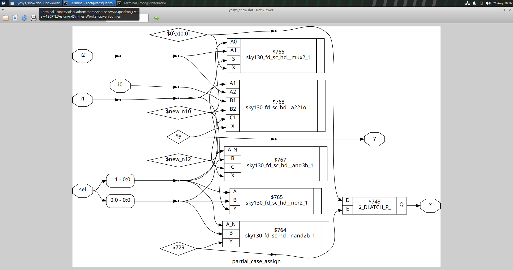

### Learning Outcome

Every output controlled by combinational logic must be assigned appropriately in every execution path.

---

## Lab 6: Overlapping CASE Statements (`bad_case.v`)

The sixth experiment examines overlapping wildcard patterns using `casez`.

    always @(*) begin
        casez (sel)
            2'b00: y = i0;
            2'b01: y = i1;
            2'b10: y = i2;
            2'b1?: y = i3;
        endcase
    end

The wildcard `?` represents a don't-care position.

Therefore:

    2'b1?

can match both:

    2'b10
    2'b11

The selector `2'b10` consequently matches two case items.

| `sel` | Matching patterns |
|---|---|
| `2'b00` | `2'b00` |
| `2'b01` | `2'b01` |
| `2'b10` | `2'b10` and `2'b1?` |
| `2'b11` | `2'b1?` |

This is an overlap problem rather than a latch problem. Wildcard patterns should therefore be written carefully so that the intended selection behavior is unambiguous.

### Waveform

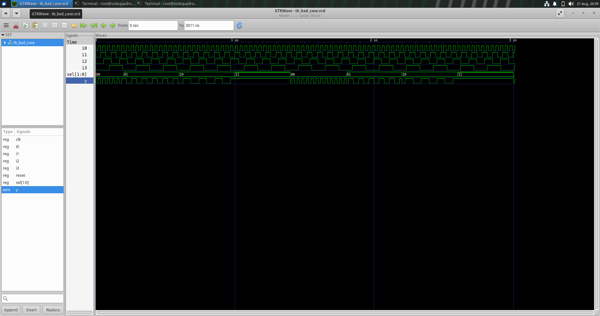

### Learning Outcome

Overlapping wildcard patterns can result in multiple matching case items. Case conditions should be designed carefully to avoid unintended behavior and possible simulation-synthesis differences.

---

## Redundancy Optimization During Synthesis

Synthesis tools optimize the logic extracted from RTL before mapping it to the target technology.

Redundant Boolean terms can be eliminated while preserving the functionality of the original design.

For example:

    F = A + A'B

can be simplified to:

    F = A + B

The optimized form contains less redundant logic.

Synthesis optimization can contribute to:

- Lower gate count
- Reduced area
- Lower logic complexity
- Improved timing
- Reduced switching activity
- Potential power savings

The general flow is:

    RTL Description
          ↓
    Logic Analysis
          ↓
    Boolean Optimization
          ↓
    Technology Mapping
          ↓
    Gate-Level Netlist

Therefore, the structure of the synthesized netlist may differ considerably from the RTL description while still implementing the same logical function.

---

## Looping Constructs in Verilog

Loops are useful for describing repetitive operations without writing the same RTL statements repeatedly.

Two forms of `for` loops are particularly important in RTL design:

- Procedural `for` loop
- Generate `for` loop

Although both use similar syntax, they serve different purposes.

### Procedural `for` Loop

A procedural loop is written inside an `always` block and is used to repeat an operation within the procedural description.

    integer i;

    always @(*) begin
        for (i = 0; i < 4; i = i + 1) begin
            y[i] = a[i];
        end
    end

Procedural loops are useful for:

- MUX logic
- DEMUX logic
- Bit-wise operations
- Array processing
- Repetitive combinational logic

### Generate `for` Loop

A generate loop is used outside procedural blocks to create repeated structural hardware during elaboration.

    genvar i;

    generate
        for (i = 0; i < WIDTH; i = i + 1) begin
            // Repeated hardware instance
        end
    endgenerate

Generate loops are particularly useful for:

- Ripple Carry Adders
- Full Adder arrays
- Register arrays
- Repeated module instances
- Parameterized designs

### Procedural FOR vs Generate FOR

| Feature | Procedural `for` | Generate `for` |
|---|---|---|
| Location | Inside an `always` block | Outside procedural blocks |
| Purpose | Repeats RTL operations | Replicates structural hardware |
| Typical application | MUX, DEMUX, bit operations | RCA and repeated modules |
| Stage | Procedural evaluation | Elaboration |
| Description style | Behavioral | Structural |

---

## Labs 7–10: Loop-Based MUX, DEMUX, and RCA

### Lab 7 – Multiplexer Using Procedural `for` Loop (`mux_generate.v`)

A multiplexer selects one input from several available inputs according to the select signal.

A loop-based implementation avoids repeatedly writing individual selection conditions and makes the RTL description more scalable.

The functional idea is:

    Multiple Inputs
          ↓
     Select Signal
          ↓
        MUX
          ↓
      Single Output

### Waveform

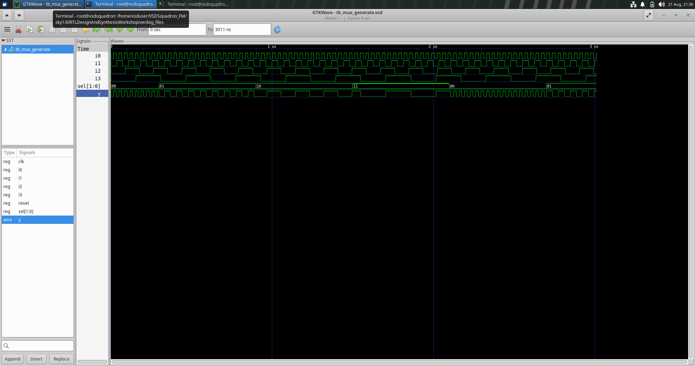

### Observation

The waveform verifies that the output changes according to the input selected by the select signal.

### Learning Outcome

A procedural loop can reduce repetitive RTL code while allowing the synthesis tool to generate the required combinational hardware.

---

### Lab 8 – Demultiplexer Using CASE (`demux_case.v`)

A demultiplexer routes a single input to one of several output lines according to the select signal.

For a four-output DEMUX:

    sel = 2'b00 → Output 0
    sel = 2'b01 → Output 1
    sel = 2'b10 → Output 2
    sel = 2'b11 → Output 3

A `case` statement can directly represent these selection conditions.

The selected output receives the input, while the remaining outputs stay inactive.

### Waveform

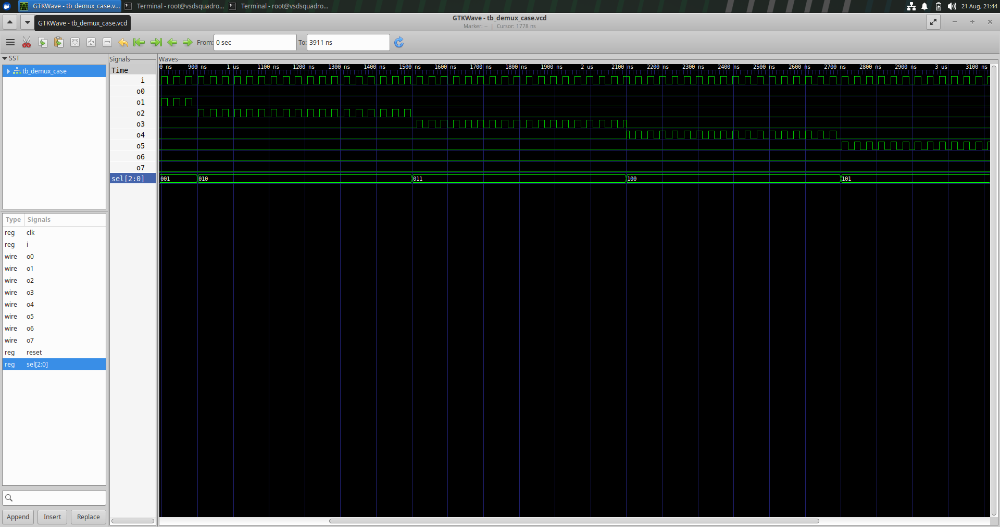

### Learning Outcome

For a DEMUX with a small number of outputs, a `case` statement provides a direct and readable implementation.

---

### Lab 9 – Demultiplexer Using Procedural `for` Loop (`demux_generate.v`)

The same DEMUX functionality can be described using a procedural loop.

The general sequence is:

    Initialize all outputs
            ↓
      Read select signal
            ↓
       Iterate through outputs
            ↓
      Identify selected index
            ↓
       Activate selected output

This avoids manually writing a separate case branch for every output.

### CASE vs Procedural LOOP

| Feature | CASE | Procedural `for` |
|---|---|---|
| Coding approach | Explicit branches | Repeated operation |
| Small designs | Simple | Simple |
| Scalability | More manual | More convenient |
| Repetition | Higher | Lower |

### Waveform

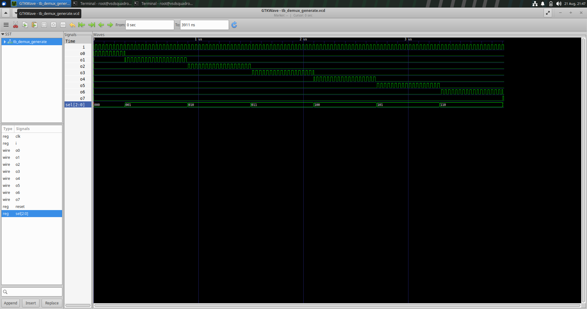

### Learning Outcome

A procedural loop provides a compact and scalable method for describing repetitive DEMUX logic.

---

### Lab 10 – Ripple Carry Adder Using Generate `for` Loop (`rca.v`)

A Ripple Carry Adder is constructed by connecting multiple Full Adder stages.

Each Full Adder receives:

- One bit from operand `A`
- One bit from operand `B`
- The carry from the previous stage

and produces:

- One sum bit
- A carry for the next stage

The carry therefore propagates from the least significant stage toward the most significant stage.

The structure can be represented as:

    A0 ──┐
    B0 ──┤
    Cin ─┤
         ↓
      Full Adder
         │
         ├── Sum0
         │
         └── Carry1
                ↓
            Full Adder
                │
                ├── Sum1
                │
                └── Carry2
                       ↓
                      ...

A generate loop can automatically instantiate one Full Adder for every bit.

    genvar i;

    generate
        for (i = 0; i < WIDTH; i = i + 1) begin

            full_adder FA (
                .a(a[i]),
                .b(b[i]),
                .cin(carry[i]),
                .sum(sum[i]),
                .cout(carry[i+1])
            );

        end
    endgenerate

The generate loop makes the design scalable because the number of Full Adder instances can be changed by changing the width parameter.

### RTL Simulation Waveform

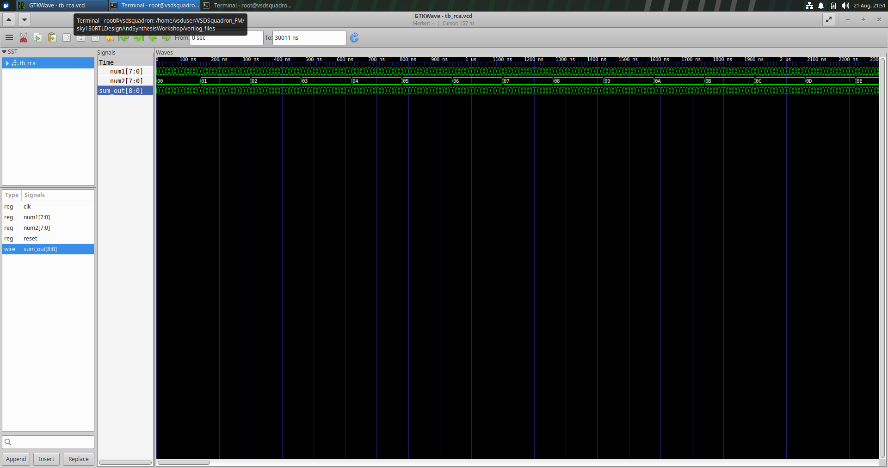

The RTL waveform verifies the addition operation and shows the resulting sum and carry behavior.

### Synthesized Netlist

The synthesized RCA netlist represents the hardware generated from the RTL description.

### Gate-Level Verification

The RTL design can be compared with the synthesized implementation during gate-level verification to ensure that the synthesis process has preserved the intended functionality.

### Learning Outcome

The RCA experiment demonstrates the practical use of a generate loop for constructing repeated structural hardware. The same concept can be extended to larger arithmetic units, register arrays, and parameterized hardware structures.

---

## Overall Summary

The Day 5 experiments demonstrate how RTL coding constructs affect the interpretation, synthesis, and verification of digital hardware.

| Topic | Main Learning |
|---|---|
| IF-ELSE | Used to describe ordered priority conditions |
| CASE | Used for multi-way selection |
| Incomplete IF | Can lead to unintended latch inference |
| Incomplete CASE | Can lead to unintended latch inference |
| Partial assignment | Can cause storage for an incompletely assigned output |
| Overlapping CASE | Can produce multiple matching conditions |
| Synthesis optimization | Removes redundant logic while preserving functionality |
| Procedural `for` | Describes repeated RTL operations |
| Generate `for` | Creates repeated structural hardware |
| MUX | Selects one input according to a control signal |
| DEMUX | Routes one input to a selected output |
| RCA | Performs binary addition using cascaded Full Adders |

---

## Conclusion

Day 5 builds on the earlier RTL design and synthesis experiments by focusing on the coding constructs used to express conditional and repetitive hardware.

The incomplete `if-else` and `case` experiments demonstrate how missing assignments can introduce unintended storage. The complete versions show how proper coverage produces predictable combinational logic. The overlapping `casez` experiment emphasizes the importance of carefully defining wildcard conditions.

The synthesis optimization experiment illustrates how redundant logic can be simplified during synthesis without changing the intended function.

The final experiments introduce procedural and generate loops. Procedural loops provide a concise way of describing repetitive operations such as MUX and DEMUX logic, while generate loops are useful for creating repeated hardware structures such as the Full Adders in a Ripple Carry Adder.

Overall, the experiments provide practical experience in writing clear, complete, scalable, and synthesis-friendly RTL while verifying the resulting hardware through simulation and synthesis.

