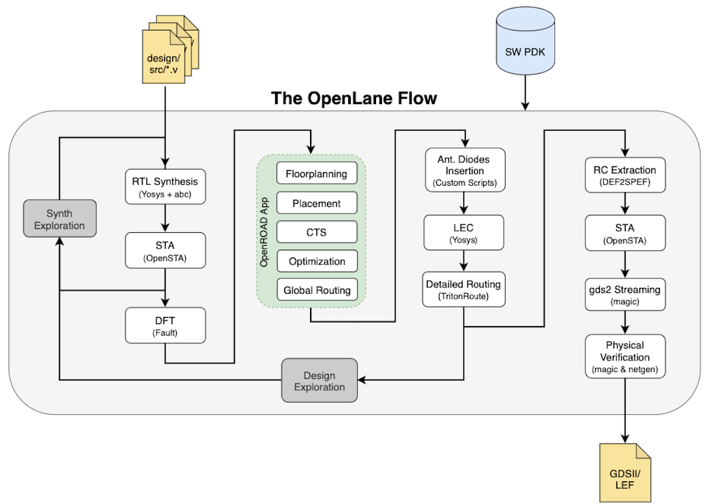
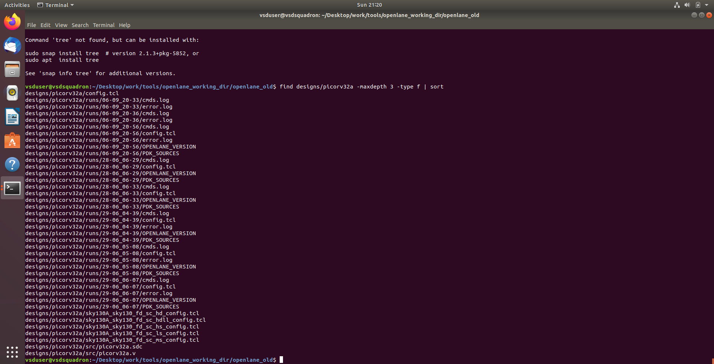
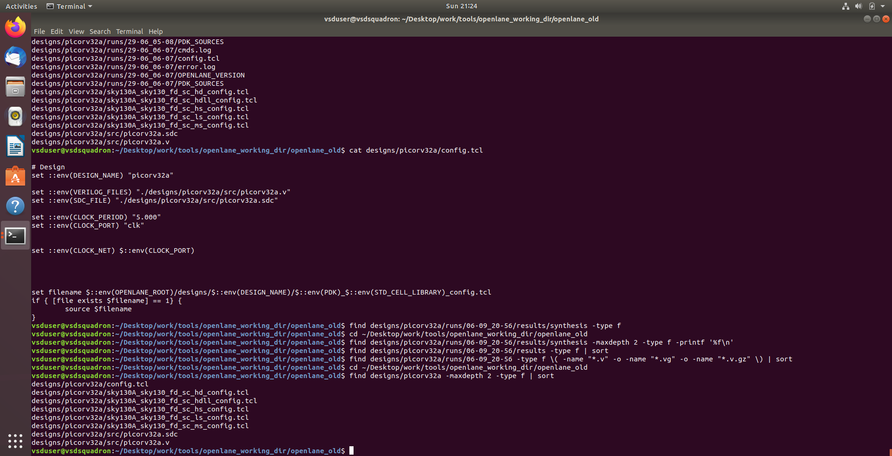
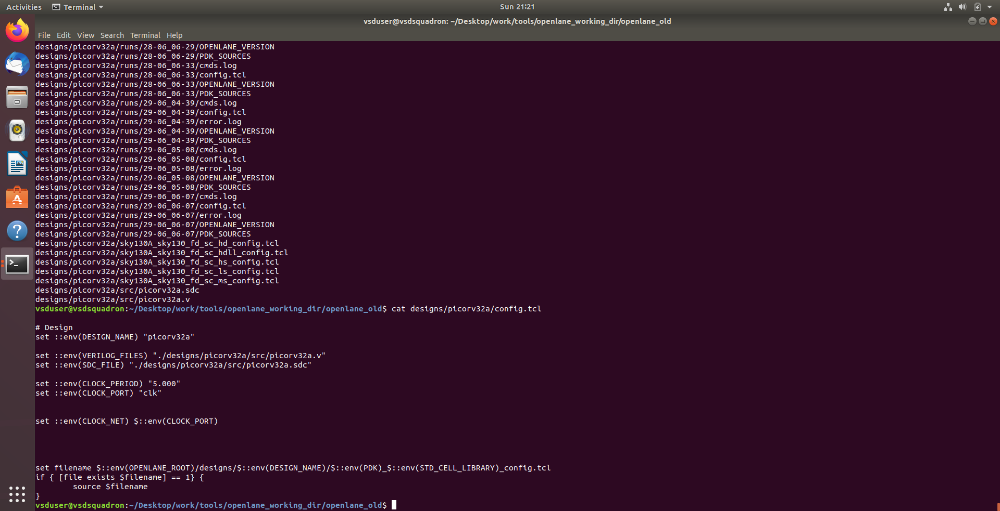
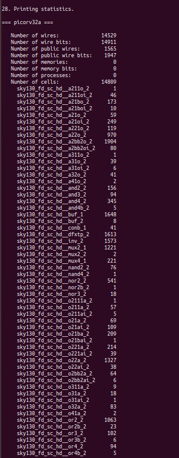
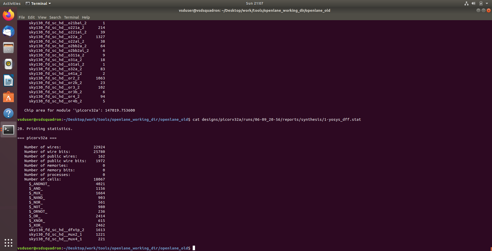
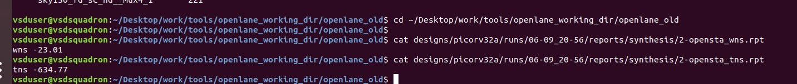

# Day-06 — RTL Design Workshop

# Inception of Open-Source EDA, OpenLane and Sky130 PDK

# 1. Overview

Day-06 focuses on understanding the open-source ASIC design ecosystem and the complete RTL-to-GDSII flow using open-source EDA tools.

The session covers the basics of semiconductor manufacturing, foundries, PDKs, RISC-V, OpenLane and the different stages involved in converting an RTL design into a physical chip layout.

The practical implementation uses the **PicoRV32A** RISC-V processor core and the **Sky130** standard-cell library. The design is prepared and synthesized using the OpenLane flow, followed by analysis of synthesis statistics and timing results.

---

# 2. Open-Source EDA

EDA (Electronic Design Automation) tools are software tools used to design, simulate, synthesize, verify and physically implement integrated circuits.

Traditional ASIC flows often depend on proprietary EDA tools. Open-source EDA provides an alternative ecosystem where tools and process information can be used for learning, research and development.

Some important open-source tools used in the ASIC flow include:

| Tool | Purpose |
|---|---|
| Yosys | RTL synthesis |
| OpenROAD | Physical design |
| OpenSTA | Static Timing Analysis |
| Magic | Layout and physical verification |
| Netgen | Netlist comparison |
| KLayout | Layout viewing and analysis |

OpenLane integrates several of these tools into an automated RTL-to-GDSII flow.

---

# 3. Semiconductor Foundry

A semiconductor foundry manufactures integrated circuits using a particular fabrication technology.

The design created by an ASIC designer contains information about the logic and physical implementation of the chip. The foundry provides the process information required to ensure that the design can be manufactured using its technology.

A **Process Design Kit (PDK)** provides the technology-specific information required by EDA tools.

---

# 4. PDK — Process Design Kit

A PDK contains technology files and models required for designing chips for a particular fabrication process.

It can contain information such as:

- Standard-cell libraries
- Timing information
- Physical abstracts
- Design rules
- SPICE models
- Technology files
- Layout information
- Device information

For this workshop, the **Sky130 PDK** is used.

---

# 5. Sky130 PDK

Sky130 is an open-source 130 nm process design kit associated with SkyWater Technology.

The PDK provides the technology information required by synthesis and physical-design tools.

The standard-cell library used in this practical is:

```text
sky130_fd_sc_hd
````

The `hd` library represents the high-density standard-cell library used for implementing the digital logic.

---

# 6. RISC-V

RISC-V is an open standard Instruction Set Architecture (ISA).

Unlike proprietary instruction set architectures, RISC-V allows designers and researchers to implement processors based on an openly specified ISA.

The workshop introduces the relationship between software instructions and the hardware required to execute those instructions.

The overall concept can be viewed as:

```text
Software Application
        ↓
Compiler
        ↓
Machine Instructions
        ↓
Processor Hardware
        ↓
Digital Logic
        ↓
Transistors
```

---

# 7. PicoRV32A

For the practical implementation, the **PicoRV32A** processor design is used.

PicoRV32 is a small RISC-V processor core designed for FPGA and ASIC implementations.

The RTL description of the processor is provided as Verilog source code and is processed through the OpenLane flow.

---

# 8. OpenLane

OpenLane is an automated RTL-to-GDSII design flow that combines several open-source EDA tools.

The flow takes an RTL design as input and performs synthesis, floorplanning, placement, clock-tree synthesis, routing and other implementation steps.

The simplified flow is:

```text
RTL
 │
 ▼
Design Preparation
 │
 ▼
Synthesis
 │
 ▼
Floorplanning
 │
 ▼
Power Planning
 │
 ▼
Placement
 │
 ▼
CTS
 │
 ▼
Routing
 │
 ▼
RC Extraction
 │
 ▼
Static Timing Analysis
 │
 ▼
Physical Verification
 │
 ▼
GDSII
```



---

# 9. OpenLane Directory Structure

The OpenLane environment contains directories for designs, scripts, PDK-related files, configuration files and individual design runs.

The PicoRV32A design contains:

```text
picorv32a/
├── config.tcl
├── src/
│   ├── picorv32a.v
│   └── picorv32a.sdc
└── runs/
```

The `config.tcl` file contains the main design configuration, while the `src` directory contains the RTL and timing constraint files.



---

# 10. Design Configuration

The main configuration file used for PicoRV32A is:

```text
designs/picorv32a/config.tcl
```

Important parameters include:

```tcl
set ::env(DESIGN_NAME) "picorv32a"
set ::env(VERILOG_FILES) "./designs/picorv32a/src/picorv32a.v"
set ::env(SDC_FILE) "./designs/picorv32a/src/picorv32a.sdc"
set ::env(CLOCK_PERIOD) "5.000"
set ::env(CLOCK_PORT) "clk"
set ::env(CLOCK_NET) $::env(CLOCK_PORT)
```

The clock period is set to **5 ns**, corresponding to a target frequency of:

```text
Frequency = 1 / 5 ns
          = 200 MHz
```





---

# 11. Design Preparation

OpenLane was launched in interactive mode using:

```bash
./flow.tcl -interactive
```

Inside the OpenLane shell, the following commands were used:

```tcl
package require openlane 0.9
prep -design picorv32a
```

The `prep` command prepares the design for the flow by loading the RTL, configuration, constraints and required technology information.

It also creates a run directory containing intermediate files, reports and logs.

---

# 12. RTL Synthesis

After design preparation, synthesis was performed using:

```tcl
run_synthesis
```

Synthesis converts the RTL description into a gate-level representation using cells from the selected standard-cell library.

The synthesis process involves:

```text
Verilog RTL
     ↓
Logic Optimization
     ↓
Technology Mapping
     ↓
Standard Cells
```

The resulting reports can be used to understand the size and composition of the synthesized design.

---

# 13. Synthesis Statistics

The synthesis report produced the following results:

| Parameter                  |          Value |
| -------------------------- | -------------: |
| Number of Wires            |         14,529 |
| Number of Wire Bits        |         14,911 |
| Number of Public Wires     |          1,565 |
| Number of Public Wire Bits |          1,947 |
| Number of Memories         |              0 |
| Number of Memory Bits      |              0 |
| Number of Processes        |              0 |
| Number of Cells            |         14,809 |
| DFFs                       |          1,613 |
| Chip Area                  | 147,019.753600 |



These statistics provide an overview of the complexity of the synthesized PicoRV32A design.

The design contains **1,613 flip-flops**, indicating the amount of sequential logic present in the synthesized implementation.

---

# 14. Detailed Cell Statistics

The detailed Yosys synthesis report provides a breakdown of the different cells used in the design.

The report contains logic cells such as:

* AND gates
* OR gates
* NAND gates
* NOR gates
* XOR/XNOR gates
* NOT gates
* Multiplexers
* Flip-flops

The reported number of `sky130_fd_sc_hd__dfxtp_2` flip-flops is:

```text
1613
```



This cell-level information is useful for understanding how the RTL design has been mapped into technology-specific standard cells.

---

# 15. Static Timing Analysis

Static Timing Analysis (STA) is used to determine whether the synthesized design can operate within the specified timing constraints.

For this design, the target clock period is:

```text
5.000 ns
```

or:

```text
200 MHz
```

Two important timing metrics are:

### WNS — Worst Negative Slack

WNS represents the worst timing violation among the analyzed paths.

A negative WNS means that at least one timing path does not meet the required timing constraint.

### TNS — Total Negative Slack

TNS represents the total amount of negative slack across all violating paths.

A negative TNS indicates the presence of timing violations across multiple paths.

---

# 16. Timing Results

The obtained timing results were:

| Timing Metric    |     Result |
| ---------------- | ---------: |
| Clock Period     |   5.000 ns |
| Target Frequency |    200 MHz |
| WNS              |  -23.01 ns |
| TNS              | -634.77 ns |



The negative WNS and TNS indicate that the design does not meet the 5 ns timing constraint at this stage of the flow.

These results provide an important indication that timing optimization would be required for the design to achieve the target frequency.

---

# 17. Physical Design Stages

After synthesis, the complete OpenLane flow continues through several physical-design stages.

### Floorplanning

Determines the physical dimensions of the chip and places major design components within the core area.

### Power Planning

Creates the power distribution network required to deliver VDD and VSS to the standard cells.

### Placement

Places the synthesized standard cells inside the available core area while optimizing timing and congestion.

### Clock Tree Synthesis

Builds a clock distribution network to deliver the clock signal to sequential elements while controlling skew and delay.

### Routing

Creates physical metal connections between the placed cells.

### RC Extraction

Estimates resistance and capacitance of the routed interconnects.

### Post-Route STA

Timing is analyzed again using the extracted parasitic information.

### Physical Verification

Checks whether the layout satisfies physical and design-rule requirements.

### GDSII

The final physical layout can be exported as a GDSII file for further manufacturing-related processing.

---

# 18. OpenLane Flow Commands Used

The main commands used during the practical are:

```bash
./flow.tcl -interactive
```

```tcl
package require openlane 0.9
```

```tcl
prep -design picorv32a
```

```tcl
run_synthesis
```

The exact available commands can vary depending on the OpenLane version and configuration.

---

# 19. Key Learning Outcomes

Through this practical, I gained an understanding of:

* Open-source EDA tools
* Semiconductor foundries
* Process Design Kits
* Sky130 technology
* RISC-V architecture
* PicoRV32A processor RTL
* OpenLane directory structure
* RTL-to-GDSII flow
* Design preparation
* RTL synthesis
* Standard-cell technology mapping
* Synthesis statistics
* Static Timing Analysis
* WNS and TNS
* Clock constraints
* Major physical-design stages

---

# 20. Repository Structure

```text
Day-6/
├── README.md
└── images/
    ├── config_tcl.png
    ├── directory_structure.png
    ├── openlane_flow.png
    ├── picorv32a_config.png
    ├── synthesis_statistics.jpg
    ├── synthesis_statistics2.png
    └── timing_results.jpg
```

---

# Conclusion

Day-06 provided practical exposure to the open-source ASIC design flow using **OpenLane, Yosys and the Sky130 PDK**.

The PicoRV32A RTL design was prepared and synthesized, and the resulting synthesis statistics were analyzed. Static Timing Analysis was also performed using the specified **5 ns clock constraint**, resulting in a WNS of **-23.01 ns** and TNS of **-634.77 ns**.

This exercise helped connect the concepts of RTL design, synthesis, standard-cell implementation and timing analysis with the larger RTL-to-GDSII ASIC design flow.
