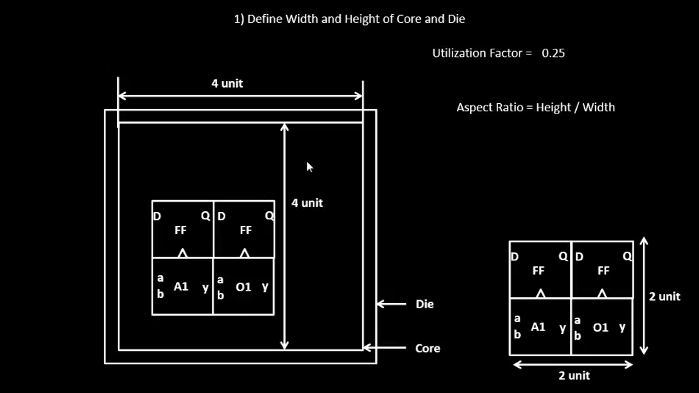
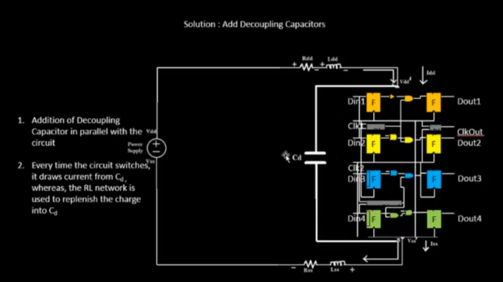
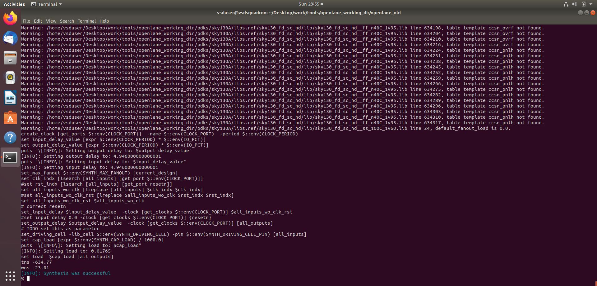
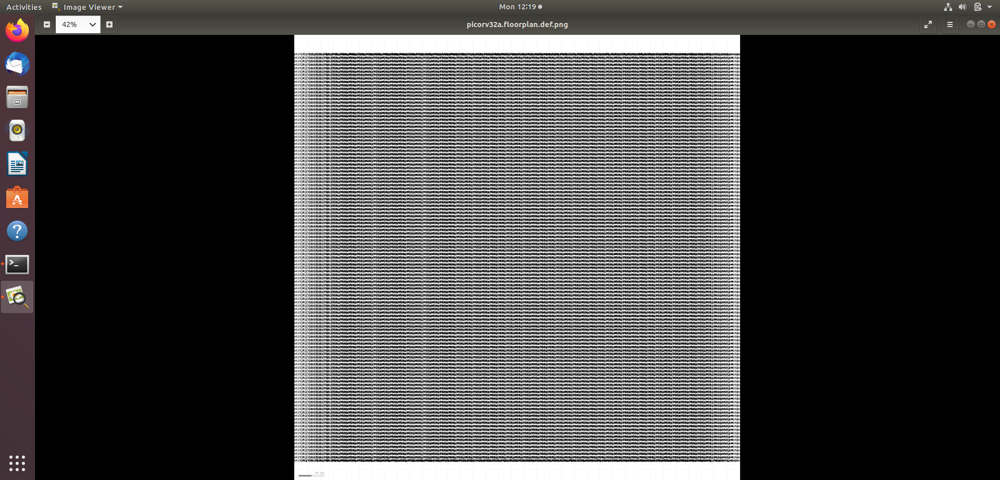
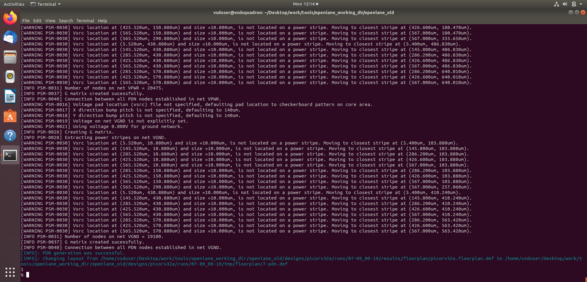
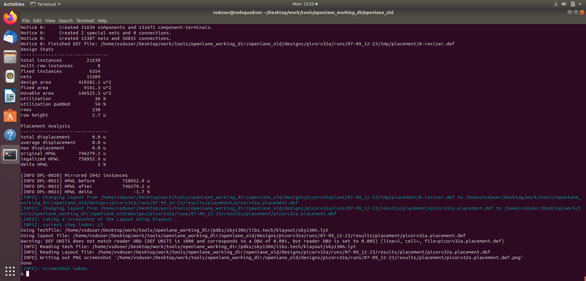
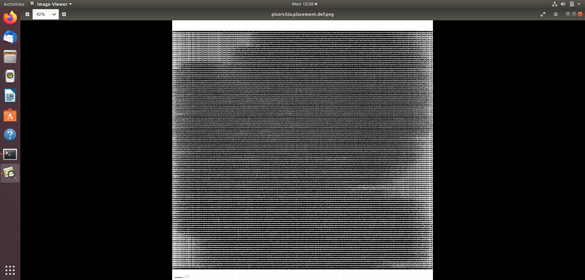
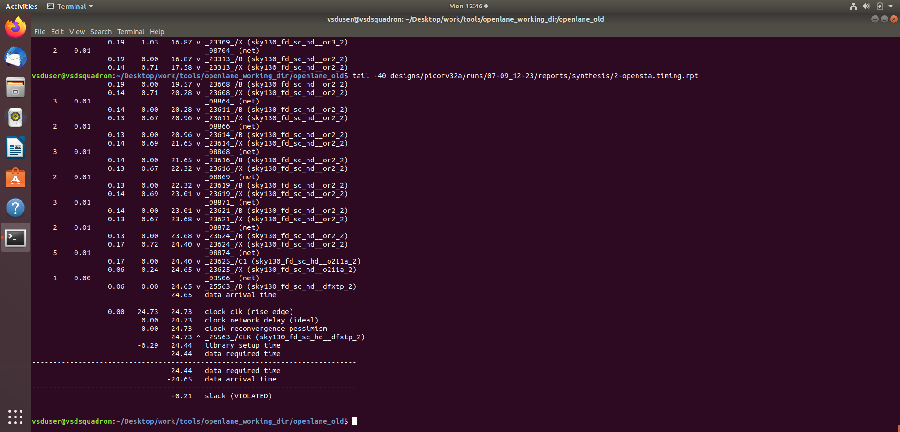
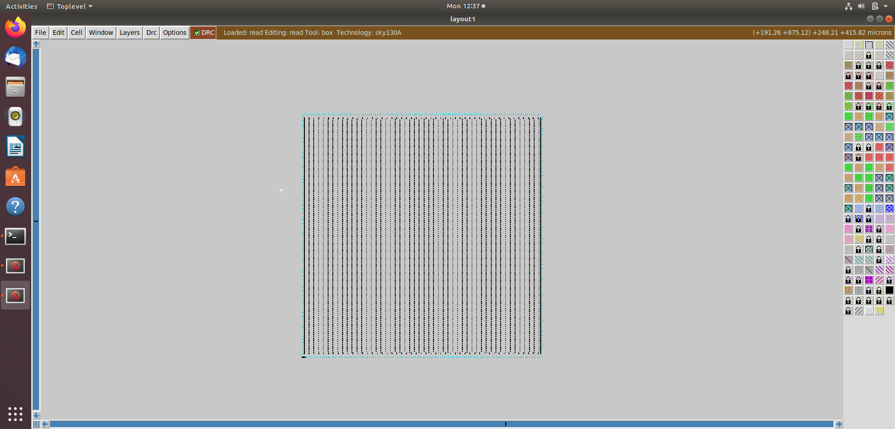

# Day-07 — Sky130 Module 2 - Good Floorplan vs Bad Floorplan and Introduction to Library Cells

## Overview

This module focuses on the physical design stages after synthesis, with emphasis on floorplanning, placement, power distribution, standard-cell libraries, cell characterization, and timing characterization using the SKY130 technology and OpenLane.

The practical work was carried out using the PicoRV32 design with OpenLane and SKY130.

---

# 1. Chip Floorplanning Considerations

## 1.1 Utilization Factor and Aspect Ratio

Floorplanning determines the physical dimensions of the chip and the arrangement of the core area.

### Utilization Factor

The utilization factor represents the percentage of the core area occupied by standard cells.

\[
Utilization = \frac{Area\ of\ cells}{Area\ of\ core} \times 100
\]

A higher utilization results in a more compact design but may increase routing congestion. Lower utilization provides more space for routing and optimization.

### Aspect Ratio

\[
Aspect\ Ratio = \frac{Height}{Width}
\]

An aspect ratio of 1 represents a square core.


---

## 1.2 Core and Die

The **die** represents the complete silicon area, while the **core** is the region inside the die where the standard cells and other internal logic are placed.

The difference between the die and core provides space for I/O cells, power distribution and other physical-design requirements.



---

## 1.3 Pre-Placed Cells

Some cells or blocks must be placed at predetermined locations before the remaining logic is placed.

These are called **pre-placed cells**.

Examples include:

- Macros
- Memory blocks
- IP blocks
- Large fixed functional blocks

Pre-placement provides predictable locations for large blocks and helps the placement and routing tools work around them.

---

## 1.4 Decoupling Capacitors

Decoupling capacitors, or **decaps**, are used to reduce local voltage fluctuations caused by sudden switching activity.

When a large number of cells switch simultaneously, they can demand a sudden amount of current from the power network. A decoupling capacitor provides temporary charge locally and helps maintain a stable supply voltage.



---

## 1.5 Power Planning

A power distribution network (PDN) distributes VDD and VSS throughout the chip.

The PDN generally consists of:

- Power rings
- Power straps
- Standard-cell power connections
- VDD and VSS networks

A proper power network reduces voltage drop and ensures reliable power delivery to the cells.


---

## 1.6 Pin Placement and Placement Blockages

I/O pins are placed around the core boundary according to connectivity and routing requirements.

Placement blockages can be used to prevent standard cells from being placed in selected regions.

These constraints help:

- Reduce routing congestion
- Protect macro regions
- Improve signal accessibility
- Maintain an organized physical layout

---

# 2. Running Floorplan Using OpenLane

The basic OpenLane flow used for the practical work was:

```text
Design Preparation
       ↓
Synthesis
       ↓
Floorplanning
       ↓
Placement
       ↓
Power Distribution
       ↓
Physical Layout / Timing Analysis
````

The design was prepared and synthesized using OpenLane before proceeding to physical design.



---

## 2.1 Floorplan Result

OpenLane generated the floorplan for the PicoRV32 design.

The obtained floorplan information included:

* Die area: approximately `659.16 × 669.88 µm`
* Core area: approximately `647.68 × 647.36 µm`

The floorplan DEF was generated successfully and a layout screenshot was produced.



The floorplan visualization shows the large number of standard-cell rows within the defined core area.



---

# 3. Library Binding and Placement

## 3.1 Netlist Binding and Initial Placement

After synthesis, the RTL is converted into a technology-mapped netlist containing cells from the selected standard-cell library.

During placement, these cells are assigned physical locations inside the core.

The placement process attempts to satisfy:

* Timing requirements
* Area constraints
* Routing requirements
* Cell density constraints

---

## 3.2 Placement Optimization

Placement is optimized using estimated:

* Wire length
* Capacitance
* Timing
* Cell density
* Congestion

Reducing interconnect length generally reduces parasitic capacitance and delay.

The placement engine therefore attempts to position connected cells close enough to achieve good timing while maintaining routability.

---

## 3.3 Congestion-Aware Placement

OpenLane uses the **RePlAce** placement engine for global placement.

Congestion-aware placement considers the availability of routing resources while positioning cells. This prevents excessive cell concentration in a particular region and helps improve the eventual routing stage.

---

# 4. Placement Practical Result

The placement stage was successfully completed for PicoRV32.

### Placement Statistics

| Parameter          |       Result |
| ------------------ | -----------: |
| Total instances    |        21639 |
| Fixed instances    |         6354 |
| Movable instances  |        15389 |
| Design area        | 419282.1 µm² |
| Fixed area         |   9141.3 µm² |
| Movable area       | 146525.5 µm² |
| Utilization        |          36% |
| Utilization padded |          54% |
| Rows               |          238 |
| Row height         |       2.7 µm |
| Original HPWL      |     746279.2 |
| Legalized HPWL     |     758952.9 |
| HPWL delta         |           2% |

The placement DEF was successfully generated.



### Placement Visualization

The generated placement image shows the standard cells distributed across the available core rows.



---

# 5. Cell Design and Characterization Flow

Standard-cell libraries contain characterized cells such as:

* Inverters
* Buffers
* Logic gates
* Multiplexers
* Flip-flops
* Other sequential and combinational cells

The cell design flow converts a transistor-level circuit into a physical layout and then characterizes its electrical and timing behaviour.


## Typical Cell Design Flow

```text
Specifications
      ↓
Circuit Design
      ↓
SPICE Simulation
      ↓
Layout Design
      ↓
DRC / LVS
      ↓
Parasitic Extraction
      ↓
Characterization
      ↓
Liberty (.lib) Generation
```

### Inputs

Typical inputs include:

* Cell functionality
* PDK technology information
* Transistor models
* Supply voltage
* Timing requirements
* Design constraints

### Circuit Design

The transistor-level circuit is designed and simulated to verify functionality and electrical behaviour.

### Layout Design

The transistor circuit is converted into physical geometry according to the technology design rules.

### Characterization

The cell is simulated under different input transition and output load conditions.

The resulting timing and power information is stored in the standard-cell Liberty file.

---

# 6. General Timing Characterization Parameters

Timing characterization is required to determine how quickly a standard cell responds to an input change and produces an output change.

## 6.1 Timing Threshold Definitions

Timing measurements use defined voltage thresholds to determine:

* Input transition time
* Output transition time
* Propagation delay

These thresholds provide consistent reference points for timing measurements.

---

## 6.2 Propagation Delay

Propagation delay is the time taken for a change at the input of a cell to produce the corresponding change at its output.

It is commonly measured between specified input and output voltage thresholds.

A smaller propagation delay generally indicates a faster cell.

---

## 6.3 Transition Time

Transition time represents how quickly a signal changes from one logic level to another.

It is normally measured between defined low and high voltage thresholds.

Both propagation delay and transition time depend on factors such as:

* Input slew
* Output load
* Cell architecture
* Operating voltage
* Process and temperature conditions

---

# 7. Timing Analysis

Static timing analysis was performed using the generated timing reports.

The timing report contains the complete critical path from a startpoint to an endpoint.

Important timing parameters include:

* Data arrival time
* Data required time
* Cell delay
* Net delay
* Setup time
* Slack



### Observed Timing Result

For the analyzed path:

```text
Data required time : 24.44 ns
Data arrival time  : 24.65 ns
Slack              : -0.21 ns
```

The reported slack is negative:

```text
Slack = -0.21 ns
```

Therefore, this particular timing path violates the setup timing requirement.

The synthesis timing report also showed:

```text
WNS = -23.01 ns
TNS = -634.77 ns
```

where:

* **WNS (Worst Negative Slack)** represents the worst timing violation.
* **TNS (Total Negative Slack)** represents the sum of negative slack across violating paths.

Negative WNS and TNS indicate that the design does not meet the specified timing constraint at this stage.

---

# 8. Physical Layout Using Magic

Magic was used to inspect the generated physical design using the SKY130 technology information together with the layout data.

The layout view allows inspection of:

* Standard-cell placement
* Metal layers
* Cell geometries
* Power structures
* Physical boundaries



---

# 9. Practical Flow Summary

The major practical sequence followed in this module was:

```text
OpenLane
   ↓
prep -design picorv32a
   ↓
run_synthesis
   ↓
run_floorplan
   ↓
run_placement
   ↓
Power Distribution / PDN
   ↓
Magic Layout Inspection
   ↓
Timing Report Analysis
```

The important generated physical-design files include:

* Floorplan DEF
* Placement DEF
* PDN DEF
* Layout screenshots
* Timing reports

---

# 10. Key Learnings

* Floorplanning defines the physical organization of the chip.
* Core utilization determines how much of the core is occupied by cells.
* Aspect ratio controls the relationship between core height and width.
* Pre-placed cells are positioned before general placement.
* Decoupling capacitors help reduce local power-supply fluctuations.
* PDN distributes VDD and VSS across the design.
* Placement assigns physical locations to synthesized standard cells.
* RePlAce performs congestion-aware global placement.
* Standard-cell libraries contain characterized cells used during technology mapping.
* Cell characterization provides timing and electrical information for library cells.
* Propagation delay and transition time are important timing parameters.
* Static timing analysis identifies paths that violate timing constraints.
* Magic provides a physical view of the generated layout.

---

## Conclusion

This module provided practical exposure to the physical-design stages following synthesis. The PicoRV32 design was taken through floorplanning, placement, power distribution and physical layout inspection using OpenLane, SKY130 and Magic.

The generated reports and layout views demonstrate how a synthesized digital design is transformed into a physically organized ASIC implementation while considering area, placement, power distribution and timing.

````

### Your Day-7 folder is now matched exactly

```text
Day-7/
├── README.md
└── images/
    ├── cell_design.png
    ├── core_die.png
    ├── decoupling_cap.png
    ├── floor_plan.png
    ├── floor_plan_comp.png
    ├── floorplanning_con.png
    ├── magic_res.png
    ├── placement_run.png
    ├── placement_vis.png
    ├── supply_lines.png
    ├── synth_comp.png
    └── timing_report.png
